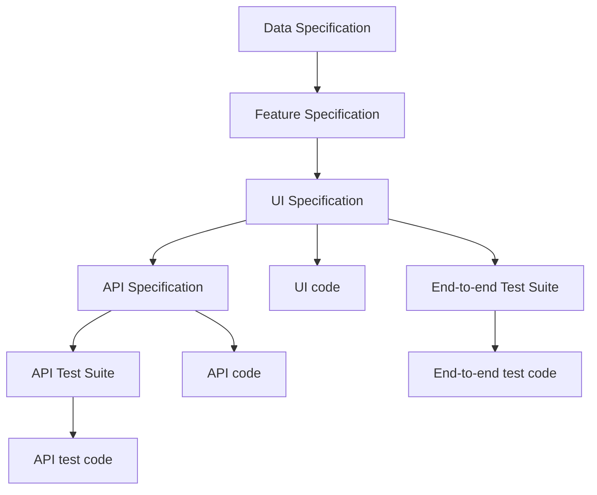

## Find Documentation

| Document                       | Location                                      |
| ------------------------------ | --------------------------------------------- |
| Project Overview Document      | `docs/core/spec/project-overview.md`          |
| Idea Document                  | `docs/{module}/ideas/{feature-name}.md`       |
| Feature Specification Document | `docs/{module}/spec/{feature-name}.md`        |
| Data Specification Document    | `docs/{module}/spec/data.md`                  |
| API Specification Document     | `docs/{module}/design/api/{api-name}.md`      |
| UI Specification Document      | `docs/{module}/design/web/{screen-name}.md`   |
| API Test Suite Document        | `docs/{module}/design/api/{api-name}.test.md` |

### Available Modules

- `core`: define shared entities and structures
  - exercise structure
  - topics
- `manage`: add management features
  - create, list, update, and delete exercises created by current user
  - create, list, update, and delete topics created by current user
- `practice`:
  - retrieve exercises for user to practice
  - submit user's responses and get feedback
  - track user's practice progress

## Get Project Overview

Read **Project Overview Document**.

## Understand Feature Behavior and Business Rules

Read **Feature Specification Document**.

## Understand Data Model

Read **Data Specification Document**.

## Understand API Contract

Read **API Specification Document**.

## Understand UI Requirements

Read **UI Specification Document**.

## Test API Endpoints

Read **API Test Suite Document**.

## Update Requirements/Business Rules

Find and update **Feature Specification Documents** related to the requirements/business rules.

## Write Software Documentation

### Feature Specification Documents

1. Read **Feature Idea Document**.
2. Follow [Feature Specification Guide](http://localhost:4173/se/documentation/requirement-analysis/feature-spec.md).

### Data Specification Documents

Follow [Data Specification Guide](http://localhost:4173/se/documentation/requirement-analysis/data-spec.md).

### UI Specification Documents

Follow [UI Specification Guide](http://localhost:4173/se/documentation/design/ui-spec.md).

### Test Suite Documents (Design Test Cases)

Follow [Test Suite Guide](http://localhost:4173/se/documentation/design/test-suite.md).

### Guides and Cheat Sheets

Follow [Cheat Sheets Guide](./cheat-sheet.md).

## Keep Everything in Sync

Whenever a document is updated, it should cascade to all related documents/code to ensure consistency. Here's the flow:

