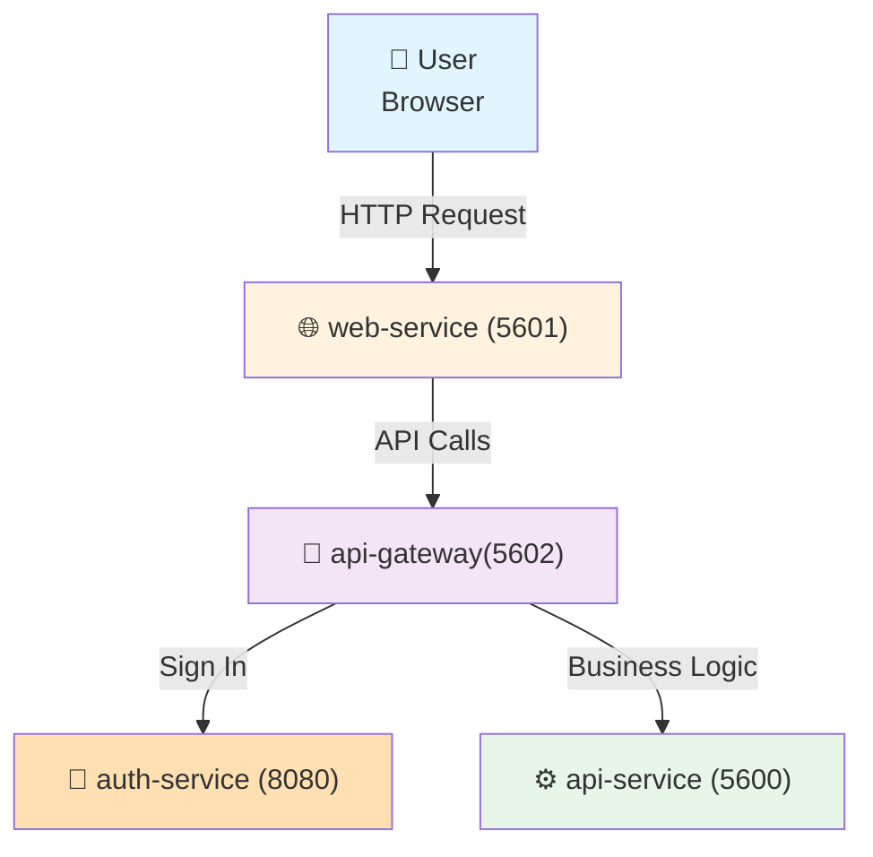

# Fluento

## Introduction

This is the Git repository for the Fluento project, a full-stack web application built as a monorepo using Turborepo and pnpm workspaces.

## Installation

```bash
git clone <repo-url>
cd fluento
pnpm install
```

For setup instructions specific to each project, see:

- `apps/api/README.md`
- `apps/api-gateway/README.md`
- `apps/web/README.md`

## Usage

### Start applications

Stop any running applications on the required ports before starting new ones:

```bash
lsof -ti tcp:5601 -i tcp:5600 -i tcp:5602 | xargs -n 1 kill -9
```

Start all applications (web, api-gateway, api) in development mode:

```bash
pnpm dev
```

Then open http://localhost:5601 in your browser.

### Run Lint

Lint all files:

```bash
pnpm run lint
```

Lint a specific project:

```bash
# lint the `web` project
pnpx eslint apps/web
```

### Manage dependencies

Install all dependencies:

```bash
pnpm install
```

Add a dependency to a specific project:

```bash
# add `lodash` to the `web` project
pnpm -F web add lodash
```

Remove a dependency from a specific project:

```bash
# remove `lodash` from the `web` project
pnpm -F web remove lodash
```

## Run project's scripts

Run an npm script in a specific project:

```bash
# run the `build` script in the `web` project
pnpm -F web run build
```

### Docker Compose

This project includes a `docker-compose.yml` file, allowing you to run and test all applications without additional setup.

To start all applications locally using Docker Compose, run:

```bash
docker compose up
```

The following services are started:

| Service        | Port | Description                                                                                         |
| -------------- | ---- | --------------------------------------------------------------------------------------------------- |
| `web-service`  | 5601 | React/Vite frontend application. Serves the user interface and communicates with the api-gateway.   |
| `api-gateway`  | 5602 | Express.js gateway that routes requests to the api-service and handles authentication via Keycloak. |
| `api-service`  | 5600 | NestJS REST API that provides core business logic and data processing.                              |
| `auth-service` | 8080 | Keycloak identity provider for authentication and authorization (OpenID Connect).                   |

**Request Flow**:



**Service Dependencies:**

- `api-gateway` waits for `auth-service` and `api-service` to be healthy before starting
- `web-service` waits for `api-service` to be healthy before starting
- All services include health checks to ensure they are running properly

## Repository Structure

This repository follows the [Turborepo workspace structure](https://c.lamhq.com/se/development/tools/turborepo/workspace-structure.md). Here's the layout:

```
├── apps/               # Runnable projects
│   ├── api/
│   ├── api-gateway/
│   ├── auth/
│   ├── infra/
│   ├── poc/
│   └── web/
├── docs/                   # Project documentation
├── commitlint.config.mjs   # Commit message linting rules
├── eslint.config.mjs       # ESLint configuration
├── lint-staged.config.mjs  # Pre-commit lint-staged hooks
├── prettier.config.mjs     # Code formatting configuration
├── turbo.json              # Turborepo task pipeline configuration
├── pnpm-workspace.yaml     # pnpm workspace definition
└── package.json            # Root package scripts and dev dependencies
```

For details about each project's structure, refer to the Project Structure section in its README.md file.

## Available Projects

| Project       | Description                                   | Techstack                |
| ------------- | --------------------------------------------- | ------------------------ |
| `api`         | Backend API service                           | NestJS, REST, TypeScript |
| `api-gateway` | API Gateway service                           | Node.js, Express         |
| `web`         | Web application                               | React, Vite, TypeScript  |
| `infra`       | Infrastructure code for deploying the project | Terraform                |
| `auth`        | Authentication service                        | Keycloak                 |
| `poc`         | Demo scripts in Python                        |                          |
