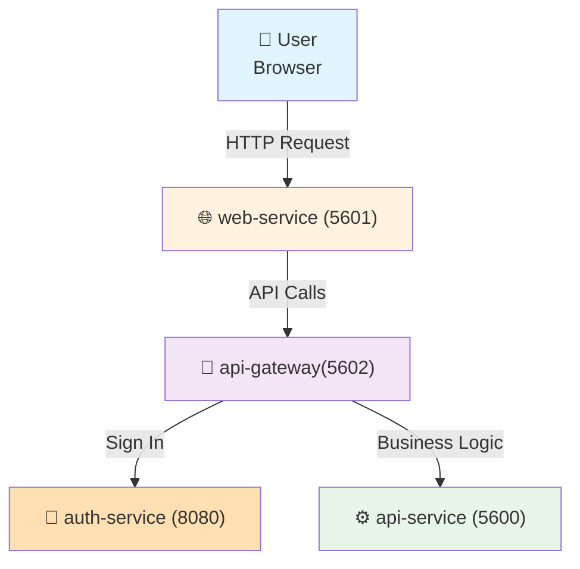

# Fluento

## Introduction

This is the Git repository for the Fluento project, a full-stack web application built as a monorepo using Turborepo and pnpm workspaces.

## Installation

```bash
git clone <repo-url>
cd fluento
pnpm install
```

Follow installation instructions in each project:

- `api`: `apps/api/README.md`
- `api-gateway`: `apps/api-gateway/README.md`
- `web`: `apps/web/README.md`

## Start applications

Start required Docker services (wait 3 seconds for each service to be ready):

```bash
# start Docker (macOS)
open -a Docker

# start database service (MongoDB)
docker compose up -d db-service

# start authentication service (Keycloak)
docker compose up -d auth-service
```

Start `web` app (port 5601, need to start Docker services first):

```bash
pnpx turbo web#dev
```

Start `api` app (port 5600, need to start Docker services first):

```bash
pnpx turbo api#dev
```

Stop running applications:

```bash
# stop web, api, api gateway
lsof -ti tcp:5601 -i tcp:5600 -i tcp:5602 | xargs -n 1 kill -9
```

## Run Lint

Lint all files:

```bash
pnpm run lint
```

Lint a specific project:

```bash
pnpx eslint apps/<project>
```

Examples:

```bash
# lint the `web` project
pnpx eslint apps/web
```

## Manage dependencies

Install all dependencies:

```bash
pnpm install
```

Add a dependency to a specific project:

```bash
pnpm -F <project> add <dependency>
```

Remove a dependency from a specific project:

```bash
pnpm -F <project> remove <dependency>
```

Examples:

```bash
# add `lodash` to the `web` project
pnpm -F web add lodash

# remove `lodash` from the `web` project
pnpm -F web remove lodash
```

## Execute commands

Run a script defined in project's `package.json`:

```bash
pnpm -F <project> run <script>
```

Run a locally installed package binary:

```bash
pnpm -F <project> exec <command>
```

Examples:

```bash
# run `build` in `web` project
pnpm -F web run build

# run Shadcn UI CLI in the `web` project
pnpm -F web exec shadcn-ui add button
```

## Repository Structure

This repository follows the [Turborepo workspace structure](https://c.lamhq.com/se/development/tools/turborepo/workspace-structure.md).

```
├── apps/                   # Runnable projects
│   └── {project}/          # See `Available Projects` section below
├── docs/                   # Project documentation
├── commitlint.config.mjs   # Commit message linting rules
├── eslint.config.mjs       # ESLint configuration
├── lint-staged.config.mjs  # Pre-commit lint-staged hooks
├── prettier.config.mjs     # Code formatting configuration
├── turbo.json              # Turborepo task pipeline configuration
├── pnpm-workspace.yaml     # pnpm workspace definition
└── package.json            # Root package scripts and dev dependencies
```

For the structure of each monorepo project, refer to `apps/{project}/README.md` file.

## Available Projects

| Project       | Description                                   | Techstack                |
| ------------- | --------------------------------------------- | ------------------------ |
| `api`         | Backend API service                           | NestJS, REST, TypeScript |
| `api-gateway` | API Gateway service                           | Node.js, Express         |
| `web`         | Web application                               | React, Vite, TypeScript  |
| `infra`       | Infrastructure code for deploying the project | Terraform                |
| `auth`        | Authentication service                        | Keycloak                 |
| `poc`         | Demo scripts in Python                        |                          |

## Docker Compose

This project includes a `docker-compose.yml` file, allowing you to run and test all applications without additional setup.

Services in the `docker-compose.yml` file:

| Service Name   | Port | Description                                                              |
| -------------- | ---- | ------------------------------------------------------------------------ |
| `web-service`  | 5601 | Display the web interface, communicates with the api-gateway.            |
| `api-gateway`  | 5602 | Route requests to the `api-service`, also validate API request           |
| `api-service`  | 5600 | Handle business logic and data processing.                               |
| `auth-service` | 8080 | Identity provider for authentication and authorization (OpenID Connect). |

**Request Flow**:



To start all applications locally using Docker Compose, run:

```bash
docker compose up
```
