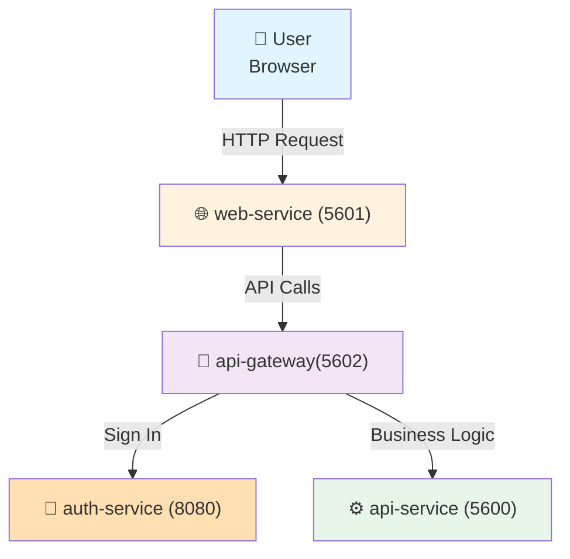

# Fluento

## Introduction

This is the Git repository for the Fluento project, a full-stack web application built as a monorepo using Turborepo and pnpm workspaces.

## Prerequisites

- macOS or Linux as development environment
- Docker (for development)
- Node.js v22 (to match with runtime environment)
- pnpm v8

For manual deployment:

- AWS CLI v2.22.x
- AWS credentials

## Installation

```bash
git clone <repo-url>
cd fluento
pnpm install
```

Follow installation instructions in each project:

- `api`: `apps/api/README.md`
- `api-gateway`: `apps/api-gateway/README.md`
- `web`: `apps/web/README.md`

## Run lint

Run lint for all files:

```bash
pnpm lint
```

Run lint for specific files:

```bash
pnpm lint <pattern>
# pnpm lint apps/web/src/
# pnpm lint apps/web/src/comm/components/PracticeForm/utils.ts
```

## Run unit tests

Run unit tests for a project (`web`, `api`):

```bash
pnpm -F <project> test
# pnpm -F web test
```

Run unit tests for files in a project:

```bash
pnpm -F <project> test <pattern>
# pnpm -F web test src/comm/components/PracticeForm/utils
```

## Run type check

```bash
pnpm -F <project> run type-check
# pnpm -F api run type-check
# pnpm -F web run type-check
```

## Run package binary

Run a locally installed package binary in a project:

```bash
pnpm -F <project> exec <command>
# pnpm -F web exec shadcn add button
```

## Manage dependencies

Add/remove a dependency for a project:

```bash
pnpm -F <project> add <dependency>

pnpm -F <project> remove <dependency>
```

## Repository Structure

This repository follows the [Turborepo workspace structure](https://c.lamhq.com/se/development/tools/turborepo/workspace-structure.md).

```
├── apps/                   # Runnable projects
│   └── <project>/          # See `Available Projects` section
├── docs/                   # Project documentation
├── commitlint.config.mjs   # Commit message linting rules
├── eslint.config.mjs       # ESLint configuration
├── lint-staged.config.mjs  # Pre-commit lint-staged hooks
├── prettier.config.mjs     # Code formatting configuration
├── turbo.json              # Turborepo task pipeline configuration
├── pnpm-workspace.yaml     # pnpm workspace definition
└── package.json            # Root package scripts and dev dependencies
```

For the structure of each monorepo project, refer to `apps/<project>/README.md` file.

## Available Projects

| Project       | Description                                   | Techstack                |
| ------------- | --------------------------------------------- | ------------------------ |
| `api`         | Backend API service                           | NestJS, REST, TypeScript |
| `api-gateway` | API Gateway service                           | Node.js, Express         |
| `web`         | Web application                               | React, Vite, TypeScript  |
| `infra`       | Infrastructure code for deploying the project | Terraform                |
| `auth`        | Authentication service                        | Keycloak                 |
| `poc`         | Demo scripts in Python                        |                          |

## Docker Compose

This project includes a `docker-compose.yml` file, allowing you to run and test all applications without additional setup.

Services in the `docker-compose.yml` file:

| Service Name   | Port | Description                                                              |
| -------------- | ---- | ------------------------------------------------------------------------ |
| `web-service`  | 5601 | Display the web interface, communicates with the api-gateway.            |
| `api-gateway`  | 5602 | Route requests to the `api-service`, also validate API request           |
| `api-service`  | 5600 | Handle business logic and data processing.                               |
| `auth-service` | 8080 | Identity provider for authentication and authorization (OpenID Connect). |

**Request Flow**:



To start all applications locally using Docker Compose, run:

```bash
docker compose up
```
