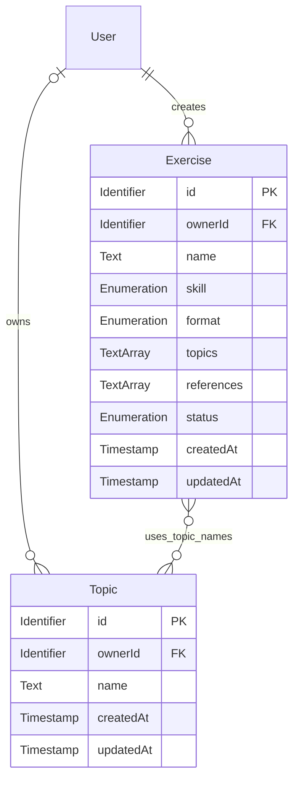

# Exercise Data Specification

## Introduction

The manage module implements user-facing features for creating and maintaining these Core-owned exercise and topic records.

This document defines the business meaning, required data, allowed values, and validation rules for the core module.

## Assumptions

1. Each exercise belongs to the authenticated user who created it.
2. Every exercise has at least one topic. Exercises retain topic names directly; topic records support topic discovery and selection.
3. Timestamps use UTC.
4. Authentication identity is managed outside the core module; the authenticated user's stable identifier is used for ownership.
5. Fields without the `Required` constraint are optional unless another constraint, such as `FormatFields`, requires them in a specific context; do not explicitly mark them `Optional`.

## Entity-Relationship Diagram

### Exercise

Represents reusable user-created English practice material across supported skills and content formats.

| Name            | ID               | Type                          | Constraints                | Default          | Description                                                      |
| --------------- | ---------------- | ----------------------------- | -------------------------- | ---------------- | ---------------------------------------------------------------- |
| Exercise ID     | `id`             | Identifier                    | Required, Unique           | —                | Stable identifier for the exercise.                              |
| Owner ID        | `ownerId`        | Identifier                    | Required                   | —                | Authenticated user who created the exercise.                     |
| Name            | `name`           | Text                          | Required, NonEmpty         | —                | Name shown to the exercise owner.                                |
| Skill           | `skill`          | Skill (Enumeration)           | Required                   | —                | English skill the exercise practices.                            |
| Format          | `format`         | Exercise Format (Enumeration) | Required, ExerciseFormat   | —                | Defines the additional fields required for the exercise.         |
| Topics          | `topics`         | List of Text                  | Required, NonEmptyList     | —                | Topic labels used for grouping and filtering.                    |
| References      | `references`     | List of Text                  | NonEmptyList               | —                | Source links associated with the exercise.                       |
| Status          | `status`         | Exercise Status (Enumeration) | Required                   | `active`         | Whether the exercise is available to practice or archived.       |
| Creation Time   | `createdAt`      | Timestamp                     | Required                   | System generated | Time the exercise was created.                                   |
| Update Time     | `updatedAt`      | Timestamp                     | Required                   | System generated | Time the exercise was last changed.                              |
| Scenario        | `scenario`       | Text                          | NonEmpty, FormatFields     | —                | Situational context for an exercise.                             |
| Prompts         | `prompts`        | List of Text                  | NonEmptyList, FormatFields | —                | Questions or counterpart utterances associated with an exercise. |
| Valid Responses | `validResponses` | List of Text                  | NonEmptyList, FormatFields | —                | Example responses that illustrate acceptable answers.            |
| Word            | `word`           | Text                          | NonEmpty, FormatFields     | —                | Vocabulary item being studied.                                   |
| Meaning         | `meaning`        | Text                          | NonEmpty, FormatFields     | —                | Explanation of the vocabulary item.                              |
| Sentences       | `sentences`      | List of Text                  | NonEmptyList, FormatFields | —                | Example sentences for a vocabulary item.                         |
| Clues           | `clues`          | List of Text                  | NonEmptyList, FormatFields | —                | Clues that help a learner identify a vocabulary item.            |
| Sentence        | `sentence`       | Text                          | NonEmpty, FormatFields     | —                | Source sentence used for articulation practice.                  |
| Paragraph       | `paragraph`      | Text                          | NonEmpty, FormatFields     | —                | Source paragraph used for articulation practice.                 |
| Words           | `words`          | List of Text                  | NonEmptyList, FormatFields | —                | Words or phrases associated with an articulation exercise.       |

### Topic

Represents a label users can select to categorize and find exercises. Topics may be user-owned or shared.

| Name          | ID          | Type       | Constraints        | Default          | Description                                            |
| ------------- | ----------- | ---------- | ------------------ | ---------------- | ------------------------------------------------------ |
| Topic ID      | `id`        | Identifier | Required, Unique   | —                | Stable identifier for the topic record.                |
| Owner ID      | `ownerId`   | Identifier |                    | —                | User who owns the topic, when it is user-specific.     |
| Name          | `name`      | Text       | Required, NonEmpty | —                | Label stored on the topic and referenced by exercises. |
| Creation Time | `createdAt` | Timestamp  | Required           | System generated | Time the topic record was created.                     |
| Update Time   | `updatedAt` | Timestamp  | Required           | System generated | Time the topic record was last changed.                |

Topic names are not globally unique. An exercise stores selected topic names, not topic identifiers; a topic label can be used by multiple exercises.

## Enumerations

### Skill

| Value           | Label         | Description                                     |
| --------------- | ------------- | ----------------------------------------------- |
| `communication` | Communication | Practice responding in real-life conversations. |
| `vocabulary`    | Vocabulary    | Practice recalling and using words in context.  |
| `articulation`  | Articulation  | Practice expressing or rephrasing thoughts.     |

### Exercise Format

| Value           | Label         | Description                                              |
| --------------- | ------------- | -------------------------------------------------------- |
| `communication` | Communication | Scenario-based conversation practice.                    |
| `word`          | Word          | Vocabulary practice centered on a target word or phrase. |
| `sentence`      | Sentence      | Sentence-level articulation practice.                    |
| `paragraph`     | Paragraph     | Paragraph-level articulation practice.                   |

### Exercise Status

| Value      | Label    | Description                                                 |
| ---------- | -------- | ----------------------------------------------------------- |
| `active`   | Active   | Available for practice.                                     |
| `archived` | Archived | Retained for the owner but unavailable in learner practice. |

## Constraints

| Rule ID        | Trigger                                                 | Business Rule                                                                                       | Violation                                                        |
| -------------- | ------------------------------------------------------- | --------------------------------------------------------------------------------------------------- | ---------------------------------------------------------------- |
| Required       | When a record is created or updated                     | Field must be present in the object; it cannot be `undefined` or `null`.                            | Reject the record and identify the omitted field.                |
| Unique         | When assigning a record identifier                      | An entity's identifier must identify only one record.                                               | Reject the record.                                               |
| NonEmpty       | When value is supplied                                  | Value must contain a non-whitespace character after trimming.                                       | Reject the value and identify the field.                         |
| NonEmptyList   | When value is supplied                                  | After trimming and removing blank entries, list contains at least one non-empty text item.          | Reject non-text items or a list that is empty after cleanup.     |
| ExerciseFormat | When an exercise is created or its skill/format changes | The selected format must be allowed for the selected skill, see "Skill-Format Compatibility" below. | Reject the exercise and identify the incompatible values.        |
| FormatFields   | When an exercise is created or its format changes       | Required fields must be present; fields that do not apply to the format must be omitted.            | Reject the exercise and identify missing or inapplicable fields. |

### Skill-Format Compatibility

| Exercise Skill  | Allowed Formats         |
| --------------- | ----------------------- |
| `communication` | `communication`         |
| `vocabulary`    | `word`                  |
| `articulation`  | `sentence`, `paragraph` |

### Format-Specific Fields

Common fields (`name`, `skill`, `format`, `topics`, `references`, and `status`) apply to every format.

| Format          | Required fields                         | Optional format-specific fields |
| --------------- | --------------------------------------- | ------------------------------- |
| `communication` | `scenario`, `prompts`, `validResponses` | —                               |
| `word`          | `word`, `meaning`, `sentences`, `clues` | —                               |
| `sentence`      | `scenario`, `sentence`, `words`         | —                               |
| `paragraph`     | `scenario`, `paragraph`, `words`        | —                               |

## Revision History

| Version | Date       | Author       | Changes                                                                                             |
| ------- | ---------- | ------------ | --------------------------------------------------------------------------------------------------- |
| 1.2     | 2026-10-07 | Fluento team | Clarified Core ownership of exercise content and related data; Manage provides management features. |
