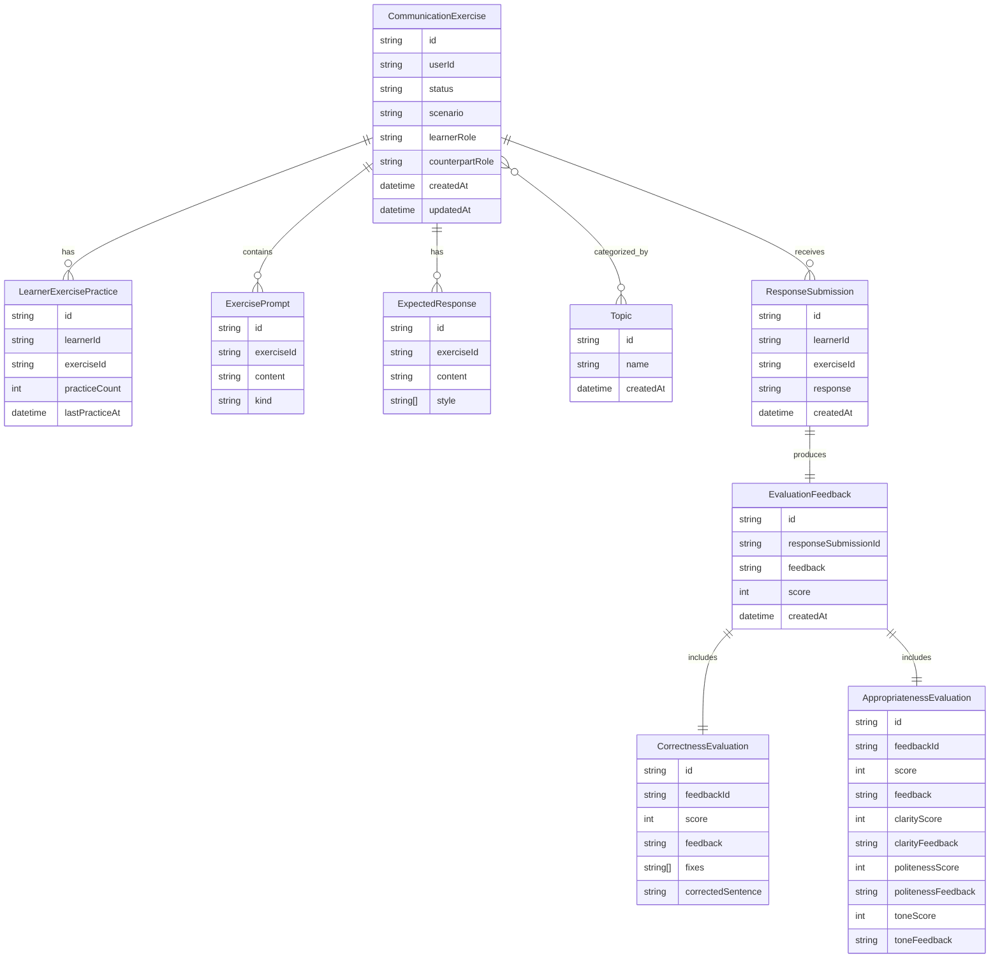

# Communication Module Database Design

## Introduction

This document describes the database design for the Communication module.

## Logical Model



### CommunicationExercise

Represents a reusable scenario-based communication exercise for practice.

**Attributes:**

| Attribute Name  | Type     | Description                                                            |
| --------------- | -------- | ---------------------------------------------------------------------- |
| id              | String   | Unique exercise identifier.                                            |
| userId          | String   | Identifier of the user who owns or created the exercise.               |
| status          | String   | Lifecycle state of the exercise. Allowed values: `active`, `archived`. |
| scenario        | String   | Real-world situation the learner is expected to respond to.            |
| learnerRole     | String   | Role played by the learner in the scenario.                            |
| counterpartRole | String   | Role played by the other participant in the scenario.                  |
| createdAt       | DateTime | When the exercise was created.                                         |
| updatedAt       | DateTime | When the exercise was last updated.                                    |

**Relationships:**

| Related Entity          | Type         | Cardinality | Description                                                         |
| ----------------------- | ------------ | ----------- | ------------------------------------------------------------------- |
| ExercisePrompt          | One-to-Many  | 1..*        | An exercise contains one or more prompts or counterpart utterances. |
| ExpectedResponse        | One-to-Many  | 1..*        | An exercise defines one or more valid target responses.             |
| Topic                   | Many-to-Many | _.._        | An exercise can belong to one or more topic categories.             |
| LearnerExercisePractice | One-to-Many  | 1..*        | The exercise can be practiced by many learners over time.           |
| ResponseSubmission      | One-to-Many  | 1..*        | Multiple learner attempts may be stored for the same exercise.      |

### Topic

Represents a thematic category used for grouping and filtering exercises.

**Attributes:**

| Attribute Name | Type     | Description                                              |
| -------------- | -------- | -------------------------------------------------------- |
| id             | String   | Unique topic identifier.                                 |
| name           | String   | Topic label, such as Restaurant, School, or Socializing. |
| createdAt      | DateTime | Timestamp when the topic was created.                    |

**Relationships:**

| Related Entity        | Type         | Cardinality | Description                                                                              |
| --------------------- | ------------ | ----------- | ---------------------------------------------------------------------------------------- |
| CommunicationExercise | Many-to-Many | _.._        | A topic can be associated with many exercises, and an exercise can have multiple topics. |

### ExercisePrompt

Stores the prompt text or counterpart utterance that initiates the exercise.

**Attributes:**

| Attribute Name | Type   | Description                                                              |
| -------------- | ------ | ------------------------------------------------------------------------ |
| id             | String | Unique prompt identifier.                                                |
| exerciseId     | String | Owning exercise.                                                         |
| content        | String | Prompt text shown to the learner.                                        |
| kind           | String | Indicates whether the content is a learner prompt or counterpart speech. |

**Relationships:**

| Related Entity        | Type        | Cardinality | Description                          |
| --------------------- | ----------- | ----------- | ------------------------------------ |
| CommunicationExercise | Many-to-One | *..1        | Each prompt belongs to one exercise. |

### ExpectedResponse

Represents an ideal or acceptable response to a prompt.

**Attributes:**

| Attribute Name | Type     | Description                                                       |
| -------------- | -------- | ----------------------------------------------------------------- |
| id             | String   | Unique expected-response identifier.                              |
| exerciseId     | String   | Owning exercise.                                                  |
| content        | String   | Model answer or reference response.                               |
| style          | String[] | Tone or delivery traits, such as polite, simple, or professional. |

**Relationships:**

| Related Entity        | Type        | Cardinality | Description                                     |
| --------------------- | ----------- | ----------- | ----------------------------------------------- |
| CommunicationExercise | Many-to-One | *..1        | Each expected response belongs to one exercise. |

### LearnerExercisePractice

Tracks per-learner exercise practice state and repetition behavior.

**Attributes:**

| Attribute Name | Type     | Description                                                    |
| -------------- | -------- | -------------------------------------------------------------- |
| id             | String   | Unique learner-practice record identifier.                     |
| learnerId      | String   | Identifier of the learner associated with the practice record. |
| exerciseId     | String   | Exercise associated with the practice record.                  |
| practiceCount  | Integer  | Number of times the learner has practiced the exercise.        |
| lastPracticeAt | DateTime | Timestamp of the learner’s most recent practice attempt.       |

**Relationships:**

| Related Entity        | Type        | Cardinality | Description                                   |
| --------------------- | ----------- | ----------- | --------------------------------------------- |
| CommunicationExercise | Many-to-One | *..1        | Each practice record belongs to one exercise. |

### ResponseSubmission

Stores a learner’s submitted response and the associated exercise context.

**Attributes:**

| Attribute Name | Type     | Description                                           |
| -------------- | -------- | ----------------------------------------------------- |
| id             | String   | Unique submission identifier.                         |
| learnerId      | String   | Identifier of the learner who submitted the response. |
| exerciseId     | String   | Exercise to which the response belongs.               |
| response       | String   | Learner’s trimmed response text before evaluation.    |
| createdAt      | DateTime | Timestamp of submission.                              |

**Relationships:**

| Related Entity        | Type        | Cardinality | Description                                   |
| --------------------- | ----------- | ----------- | --------------------------------------------- |
| CommunicationExercise | Many-to-One | *..1        | Each submission belongs to one exercise.      |
| EvaluationFeedback    | One-to-One  | 1..1        | Each submission receives a single evaluation. |

### EvaluationFeedback

Represents the AI-generated feedback from evaluating a learner response.

**Attributes:**

| Attribute Name       | Type     | Description                             |
| -------------------- | -------- | --------------------------------------- |
| id                   | String   | Unique evaluation identifier.           |
| responseSubmissionId | String   | Related learner submission.             |
| feedback             | String   | Summary of the learner’s result.        |
| score                | Integer  | Overall evaluation score from 0 to 100. |
| createdAt            | DateTime | Timestamp when evaluation was created.  |

**Relationships:**

| Related Entity            | Type       | Cardinality | Description                                             |
| ------------------------- | ---------- | ----------- | ------------------------------------------------------- |
| ResponseSubmission        | One-to-One | 1..1        | Each response has exactly one evaluation record.        |
| CorrectnessEvaluation     | One-to-One | 1..1        | Correctness details are attached to the evaluation.     |
| AppropriatenessEvaluation | One-to-One | 1..1        | Appropriateness details are attached to the evaluation. |

### CorrectnessEvaluation

Captures grammar, spelling, and correction feedback for the submitted response.

**Attributes:**

| Attribute Name    | Type     | Description                                       |
| ----------------- | -------- | ------------------------------------------------- |
| id                | String   | Unique correctness record identifier.             |
| feedbackId        | String   | Owning evaluation result.                         |
| score             | Integer  | Score between 0 and 100.                          |
| feedback          | String   | Feedback about correctness, grammar, or spelling. |
| fixes             | String[] | Suggested grammar or spelling corrections.        |
| correctedSentence | String   | Cleaned-up corrected version of the response.     |

**Relationships:**

| Related Entity     | Type        | Cardinality | Description                                        |
| ------------------ | ----------- | ----------- | -------------------------------------------------- |
| EvaluationFeedback | Many-to-One | *..1        | Each correctness record belongs to one evaluation. |

### AppropriatenessEvaluation

Measures relevance and quality of the response in the conversation context.

**Attributes:**

| Attribute Name     | Type    | Description                               |
| ------------------ | ------- | ----------------------------------------- |
| id                 | String  | Unique appropriateness record identifier. |
| feedbackId         | String  | Owning evaluation result.                 |
| score              | Integer | Overall appropriateness score.            |
| feedback           | String  | Overall evaluation message.               |
| clarityScore       | Integer | Score for clarity.                        |
| clarityFeedback    | String  | Explanation of clarity assessment.        |
| politenessScore    | Integer | Score for politeness.                     |
| politenessFeedback | String  | Explanation of politeness assessment.     |
| toneScore          | Integer | Score for tone appropriateness.           |
| toneFeedback       | String  | Explanation of tone assessment.           |

**Relationships:**

| Related Entity     | Type        | Cardinality | Description                                            |
| ------------------ | ----------- | ----------- | ------------------------------------------------------ |
| EvaluationFeedback | Many-to-One | *..1        | Each appropriateness record belongs to one evaluation. |

## Physical Model

### Collection: `exercises`

This collection stores reusable communication exercises.

```json
{
  "_id": "64f5c1d2a9b4e2f1d3c4b5a6",
  "id": "ex_123",
  "topics": ["Restaurant", "Ordering"],
  "scenario": "ordering food in a restaurant",
  "learnerRole": "customer",
  "counterpartRole": "waiter",
  "prompts": ["Say that you would like to order a meal."],
  "expectedResponses": [
    {
      "content": "I would like to order the grilled salmon, please.",
      "style": ["polite", "simple"]
    },
    {
      "content": "Could I have the chicken curry with rice?",
      "style": ["polite", "clear"]
    }
  ],
  "createdAt": "2026-08-13T10:00:00Z",
  "updatedAt": "2026-08-13T10:00:00Z"
}
```

**Key design decisions:**

- `topics` is stored as an array to support `topics` filtering without a join.
- `prompts` is a string array so the client can render all exercise instructions in order.
- `expectedResponses` is embedded as an array of objects because the response payload is always shown with the exercise.

**Indexes:**

| Index          | Purpose                                                        |
| -------------- | -------------------------------------------------------------- |
| `topics_index` | Filter exercises by topic values in Get Practice Exercises API |

**Constraints:**

- `expectedResponses.style` should be normalized to lowercase values such as `polite`, `clear`, `simple`, and `formal`.

### Collection: `response_submissions`

This collection stores each learner attempt and the resulting evaluation.

```json
{
  "_id": "64f5d8a6c2ed4a7f82024b91",
  "learnerId": "lear_42",
  "exerciseId": "ex_123",
  "response": "Lets meet tomorrow to discuss the project.",
  "score": 95,
  "feedback": "Excellent work. Your response is clear, polite, and appropriate for the scenario.",
  "createdAt": "2026-08-13T11:05:00Z",
  "correctness": {
    "score": 95,
    "feedback": "Your response is grammatically correct, with one minor contraction improvement.",
    "correctedSentence": "Let's meet tomorrow to discuss the project.",
    "fixes": ["Use the contraction form: 'Let's' instead of 'Lets'."]
  },
  "appropriateness": {
    "score": 95,
    "feedback": "The response is relevant to the prompt and matches the tone expected in the scenario.",
    "clarity": {
      "score": 96,
      "feedback": "The message is easy to understand and free of ambiguity."
    },
    "politeness": {
      "score": 97,
      "feedback": "The response shows courtesy and respects the other person."
    },
    "tone": {
      "score": 94,
      "feedback": "The tone is friendly and appropriate for a conversation in this context."
    }
  }
}
```

**Indexes:**

| Index                        | Purpose                                             |
| ---------------------------- | --------------------------------------------------- |
| `learnerId_index`            | Fetch learner history or recent attempts            |
| `learnerId_exerciseId_index` | Find the learner's practice count and retry history |
| `createdAt_index`            | Sort by most recent submission                      |

**Constraints:**

- The `response` field should be trimmed before persistence and validation should reject empty strings.

### Collection: `learner_exercise_practices`

This collection records each learner’s practice statistics, enabling sorting the exercises by last practice date or by practice count.

```json
{
  "_id": "64f5d8a6c2ed4a7f82024b92",
  "learnerId": "lear_42",
  "exerciseId": "ex_123",
  "practiceCount": 2,
  "lastPracticeAt": "2026-08-13T11:15:00Z"
}
```

**Indexes:**

| Index                        | Purpose                                              |
| ---------------------------- | ---------------------------------------------------- |
| `learnerId_exerciseId_index` | Ensure a single practice record per learner/exercise |

**Constraints:**

- Each `learner_exercise_practices` record must have a unique `(learnerId, exerciseId)` pair. The same exercise may have different `practiceCount` values for different learners.
- `practiceCount` is incremented atomically per learner per exercise after each successful submission.
- `lastPracticeAt` is updated to the timestamp of the most recent successful practice.

## Seed sample data

```javascript
// Insert sample exercises
db.getCollection('exercises').deleteMany({});
db.getCollection('exercises').insertMany([
  {
    _id: ObjectId('6a8134985ed2456c91a10b4d'),
    topics: ['Restaurant'],
    scenario: 'ordering coffee',
    learnerRole: 'customer',
    counterpartRole: 'barista',
    prompts: ['Order a coffee politely.'],
    expectedResponses: [
      {
        content: 'I would like a cappuccino, please.',
        style: ['polite', 'simple'],
      },
      {
        content: 'Could I have a latte with almond milk?',
        style: ['polite', 'clear'],
      },
    ],
    createdAt: new Date('2026-08-13T10:00:00Z'),
    updatedAt: new Date('2026-08-13T10:00:00Z'),
  },
  {
    _id: ObjectId('6a8134985ed2456c91a10b4e'),
    topics: ['Hotel'],
    scenario: 'booking a hotel room',
    learnerRole: 'guest',
    counterpartRole: 'receptionist',
    prompts: ['Ask for a room reservation.'],
    expectedResponses: [
      {
        content: 'I would like to book a double room for two nights.',
        style: ['polite', 'simple'],
      },
      {
        content: 'Could you please reserve a single room for me?',
        style: ['polite', 'clear'],
      },
    ],
    createdAt: new Date('2026-08-13T10:00:00Z'),
    updatedAt: new Date('2026-08-13T10:00:00Z'),
  },
]);

// Insert sample learner practice counts
db.getCollection('learner_exercise_practices').deleteMany({});
db.getCollection('learner_exercise_practices').insertMany([
  {
    learnerId: 'lear_1',
    exerciseId: ObjectId('6a8134985ed2456c91a10b4d'),
    practiceCount: 2,
    lastPracticeAt: new Date('2026-08-13T11:10:00Z'),
  },
  {
    learnerId: 'lear_1',
    exerciseId: ObjectId('6a8134985ed2456c91a10b4e'),
    practiceCount: 0,
    lastPracticeAt: null,
  },
  {
    learnerId: 'lear_2',
    exerciseId: ObjectId('6a8134985ed2456c91a10b4d'),
    practiceCount: 1,
    lastPracticeAt: new Date('2026-08-13T10:45:00Z'),
  },
]);
```

## Get exercises for practice

Retrieve exercises ordered by recency of practice, favors unattempted exercises first:

```javascript
db.getCollection('exercises').aggregate([
  {
    $lookup: {
      from: 'learner_exercise_practices',
      let: { exId: '$_id' },
      pipeline: [
        {
          $match: {
            $expr: {
              $and: [
                { $eq: ['$exerciseId', '$$exId'] },
                { $eq: ['$learnerId', 'lear_1'] },
              ],
            },
          },
        },
        { $project: { practiceCount: 1, lastPracticeAt: 1 } },
      ],
      as: 'practiceData',
    },
  },
  {
    $addFields: {
      practiceCount: {
        $ifNull: [{ $arrayElemAt: ['$practiceData.practiceCount', 0] }, 0],
      },
      lastPracticeAt: {
        $ifNull: [{ $arrayElemAt: ['$practiceData.lastPracticeAt', 0] }, null],
      },
    },
  },
  {
    $sort: {
      lastPracticeAt: 1,
    },
  },
]);
```

## Changelog

| Version | Date       | Changes                                                                                                                                                                                                         |
| ------- | ---------- | --------------------------------------------------------------------------------------------------------------------------------------------------------------------------------------------------------------- |
| 1.0     | 2026-08-14 | Initial communication data model based on the requirement and API specifications for exercise retrieval, practice repetition logic, and response evaluation.                                                    |
| 1.1     | 2026-08-14 | Removed the Learner entity, removed prompt ordering and practice timestamps, renamed response fields, removed duplicated alternatives from evaluation feedback, and added overall score to evaluation feedback. |
| 1.2     | 2026-08-14 | Added the MongoDB physical model, collection-level schema examples, index strategy.                                                                                                                             |
