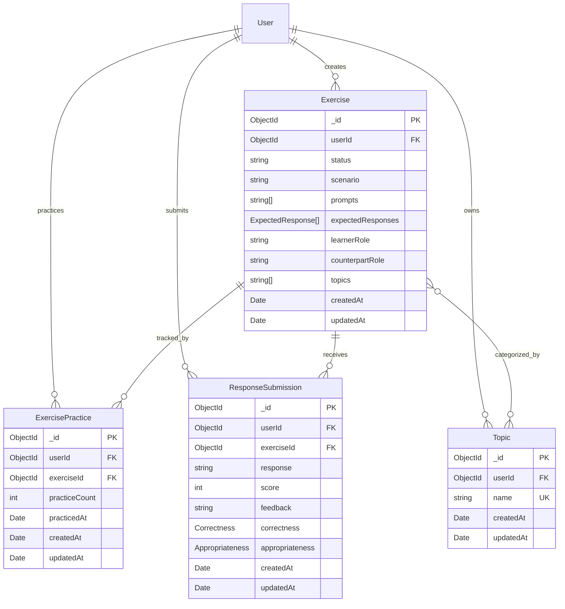

# Communication Module Database Design

## Introduction

This document describes the MongoDB collections, embedded documents, relationships, indexes, storage details, and initialization scripts for the Communication module.

## ER Diagram



`ExpectedResponse`, `Correctness`, and `Appropriateness` are embedded documents. They are not separate collections. MongoDB references to `users` are represented by `userId`; references to exercises are represented by `exerciseId`.

## `exercises` collection

**Description**: Stores reusable scenario-based communication exercises. Prompts, expected responses, and topic names are embedded so an exercise can be returned as a single practice payload.

**Schema Definition**:

| Field                       | Description                            | Data Type                   | Constraints                                                               |
| --------------------------- | -------------------------------------- | --------------------------- | ------------------------------------------------------------------------- |
| `_id`                       | MongoDB document identifier            | ObjectId                    | Primary key, auto-generated                                               |
| `userId`                    | User who created the exercise          | ObjectId                    | Required, reference to `users`                                            |
| `status`                    | Exercise lifecycle state               | String                      | Enum: `active`, `archived`; default `active`                              |
| `scenario`                  | Situation represented by the exercise  | String                      | Required                                                                  |
| `prompts`                   | Counterpart utterances or instructions | Array of String             | Defaults to `[]`                                                          |
| `expectedResponses`         | Acceptable learner responses           | Array of embedded documents | Defaults to `[]`; each `content` is required and `style` defaults to `[]` |
| `expectedResponses.content` | Reference response text                | String                      | Required                                                                  |
| `expectedResponses.style`   | Response style labels                  | Array of String             | Defaults to `[]`                                                          |
| `learnerRole`               | Role played by the learner             | String                      | Optional                                                                  |
| `counterpartRole`           | Role played by the other participant   | String                      | Optional                                                                  |
| `topics`                    | Topic names used for filtering         | Array of String             | Defaults to `[]`                                                          |
| `createdAt`                 | Creation timestamp                     | Date                        | Required, generated by timestamps                                         |
| `updatedAt`                 | Last modification timestamp            | Date                        | Required, generated by timestamps                                         |

**Relationships**:

| Related Collection     | Type                       | Cardinality | Description                                                                            |
| ---------------------- | -------------------------- | ----------- | -------------------------------------------------------------------------------------- |
| `users`                | Many-to-One                | *..1        | Each exercise has one creator.                                                         |
| `topics`               | Many-to-Many by topic name | _.._        | An exercise can contain multiple topic names; a topic can classify multiple exercises. |
| `exercise_practices`   | One-to-Many                | 1..*        | An exercise can have one practice record per learner.                                  |
| `response_submissions` | One-to-Many                | 1..*        | An exercise can receive many learner submissions.                                      |

**Indexes**:

| Fields   | Type  | Purpose                                                                                             |
| -------- | ----- | --------------------------------------------------------------------------------------------------- |
| `topics` | INDEX | Supports filtering exercises by topic.                                                              |
| `status` | INDEX | Recommended for filtering active exercises; the current Mongoose schema does not create this index. |

**Storage Details**:

- Stored in MongoDB collection `exercises` using the default WiredTiger storage engine.
- Prompts and expected responses are embedded because they are read with the exercise and are bounded by the exercise document.
- Topic names are denormalized as strings. The `topics` collection provides topic discovery, while the exercise stores the filterable values.
- Mongoose timestamps maintain `createdAt` and `updatedAt`.

## `topics` collection

**Description**: Stores topic labels available for grouping and filtering communication exercises.

**Schema Definition**:

| Field       | Description                              | Data Type | Constraints                       |
| ----------- | ---------------------------------------- | --------- | --------------------------------- |
| `_id`       | MongoDB document identifier              | ObjectId  | Primary key, auto-generated       |
| `userId`    | User who owns the topic, when applicable | ObjectId  | Optional, reference to `users`    |
| `name`      | Topic label                              | String    | Required, indexed                 |
| `createdAt` | Creation timestamp                       | Date      | Required, generated by timestamps |
| `updatedAt` | Last modification timestamp              | Date      | Required, generated by timestamps |

**Relationships**:

| Related Collection | Type                       | Cardinality | Description                                 |
| ------------------ | -------------------------- | ----------- | ------------------------------------------- |
| `users`            | Many-to-One                | *..1        | A topic may be owned by one user.           |
| `exercises`        | Many-to-Many by topic name | _.._        | A topic name may be used by many exercises. |

**Indexes**:

| Fields | Type  | Purpose                              |
| ------ | ----- | ------------------------------------ |
| `name` | INDEX | Supports topic lookup and filtering. |

**Storage Details**:

- Stored in MongoDB collection `topics` using WiredTiger.
- Topic names are currently not unique at the database level. Duplicate prevention, if required, must be added with a unique index and an agreed case-normalization rule.
- Mongoose timestamps maintain `createdAt` and `updatedAt`.

## `exercise_practices` collection

**Description**: Stores aggregate practice state for one learner and one exercise. It supports ordering practice exercises and showing repetition progress.

**Schema Definition**:

| Field           | Description                    | Data Type | Constraints                        |
| --------------- | ------------------------------ | --------- | ---------------------------------- |
| `_id`           | MongoDB document identifier    | ObjectId  | Primary key, auto-generated        |
| `userId`        | Learner identifier             | ObjectId  | Required, reference to `users`     |
| `exerciseId`    | Practiced exercise identifier  | ObjectId  | Required, reference to `exercises` |
| `practiceCount` | Number of successful practices | Number    | Defaults to `0`                    |
| `practicedAt`   | Most recent practice timestamp | Date      | Defaults to the current date       |
| `createdAt`     | Creation timestamp             | Date      | Generated by timestamps            |
| `updatedAt`     | Last modification timestamp    | Date      | Generated by timestamps            |

**Relationships**:

| Related Collection | Type        | Cardinality | Description                                  |
| ------------------ | ----------- | ----------- | -------------------------------------------- |
| `users`            | Many-to-One | *..1        | Each practice record belongs to one learner. |
| `exercises`        | Many-to-One | *..1        | Each practice record tracks one exercise.    |

**Indexes**:

| Fields                   | Type         | Purpose                                                                                                       |
| ------------------------ | ------------ | ------------------------------------------------------------------------------------------------------------- |
| (`userId`, `exerciseId`) | UNIQUE INDEX | Enforces one aggregate practice record per learner and exercise and supports lookup during practice ordering. |

**Storage Details**:

- Stored in MongoDB collection `exercise_practices` using WiredTiger.
- The compound unique index prevents duplicate counters for the same learner/exercise pair.
- Updates to `practiceCount` and `practicedAt` should be performed atomically for a learner/exercise pair.
- Mongoose timestamps maintain `createdAt` and `updatedAt`.

## `response_submissions` collection

**Description**: Stores a learner response together with the AI-generated overall, correctness, and appropriateness evaluation.

**Schema Definition**:

| Field                           | Description                        | Data Type         | Constraints                                          |
| ------------------------------- | ---------------------------------- | ----------------- | ---------------------------------------------------- |
| `_id`                           | MongoDB document identifier        | ObjectId          | Primary key, auto-generated                          |
| `userId`                        | Learner who submitted the response | ObjectId          | Required, reference to `users`                       |
| `exerciseId`                    | Exercise being answered            | ObjectId          | Required, reference to `exercises`                   |
| `response`                      | Learner response text              | String            | Required                                             |
| `score`                         | Overall evaluation score           | Number            | Required; application scores responses from 0 to 100 |
| `feedback`                      | Overall evaluation feedback        | String            | Required                                             |
| `correctness`                   | Grammar and spelling evaluation    | Embedded document | Required                                             |
| `correctness.score`             | Correctness score                  | Number            | Required                                             |
| `correctness.feedback`          | Correctness explanation            | String            | Required                                             |
| `correctness.fixes`             | Suggested corrections              | Array of String   | Defaults to `[]`                                     |
| `correctness.correctedSentence` | Corrected response                 | String            | Required                                             |
| `appropriateness`               | Context and tone evaluation        | Embedded document | Required                                             |
| `appropriateness.score`         | Appropriateness score              | Number            | Required                                             |
| `appropriateness.feedback`      | Appropriateness explanation        | String            | Required                                             |
| `appropriateness.clarity`       | Clarity evaluation                 | Embedded document | Required; `score` and `feedback` required            |
| `appropriateness.politeness`    | Politeness evaluation              | Embedded document | Required; `score` and `feedback` required            |
| `appropriateness.tone`          | Tone evaluation                    | Embedded document | Required; `score` and `feedback` required            |
| `createdAt`                     | Submission timestamp               | Date              | Required, generated by timestamps                    |
| `updatedAt`                     | Last modification timestamp        | Date              | Required, generated by timestamps                    |

**Relationships**:

| Related Collection | Type        | Cardinality | Description                             |
| ------------------ | ----------- | ----------- | --------------------------------------- |
| `users`            | Many-to-One | *..1        | Each submission belongs to one learner. |
| `exercises`        | Many-to-One | *..1        | Each submission answers one exercise.   |

**Indexes**:

| Fields                   | Type  | Purpose                                                  |
| ------------------------ | ----- | -------------------------------------------------------- |
| (`userId`, `exerciseId`) | INDEX | Supports a learner's submission history for an exercise. |
| `createdAt` descending   | INDEX | Supports recent-submission queries.                      |

**Storage Details**:

- Stored in MongoDB collection `response_submissions` using WiredTiger.
- Evaluation details are embedded because they are created and read as one immutable evaluation result.
- Mongoose timestamps maintain `createdAt` and `updatedAt`.

## Scripts

MongoDB replica set initialization and development seed data are maintained in `apps/db/init-rs.js` and `apps/db/seed.js`.

The following snippets show the collection and index setup represented by the current application schemas:

```javascript
db.createCollection('exercises');
db.createCollection('topics');
db.createCollection('exercise_practices');
db.createCollection('response_submissions');

db.topics.createIndex({ name: 1 });
db.exercise_practices.createIndex({ userId: 1, exerciseId: 1 }, { unique: true });
db.response_submissions.createIndex({ userId: 1, exerciseId: 1 });
db.response_submissions.createIndex({ createdAt: -1 });
```

The development seed script creates users, topics, exercises, and learner practice records. It removes only the sample records it owns before inserting them, so it can be rerun during local development.

## Changelog

| Version | Date       | Changes                                                                                                                                                                                                                                |
| ------- | ---------- | -------------------------------------------------------------------------------------------------------------------------------------------------------------------------------------------------------------------------------------- |
| 1.0     | 2026-08-14 | Initial communication data model for exercise retrieval, practice tracking, and response evaluation.                                                                                                                                   |
| 1.1     | 2026-09-07 | Aligned the model with the implemented MongoDB schemas: embedded prompts, expected responses, and evaluation details; removed unregistered prompt and evaluation collections; documented collection-level indexes and storage details. |
