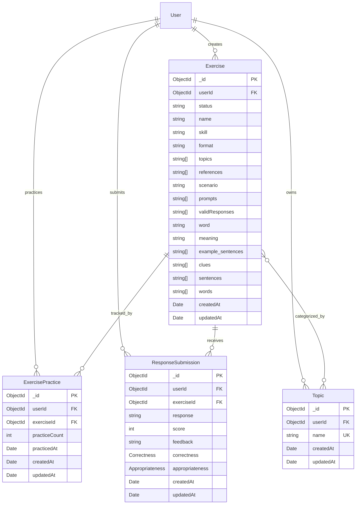

# Database Design

## Introduction

This document describes the MongoDB collections, embedded documents, relationships, indexes, storage details, and initialization scripts for the Practice module.

## ER Diagram



`Correctness` and `Appropriateness` are embedded documents. They are not separate collections. MongoDB references to `users` are represented by `userId`; references to exercises are represented by `exerciseId`.

## `exercises` collection

**Description**: Stores reusable practice exercises across communication, vocabulary, and articulation skills. Exercise content is embedded so an exercise can be returned as a single practice payload.

**Schema Definition**:

| Field               | Data Type       | Description                               | Constraints                                            |
| ------------------- | --------------- | ----------------------------------------- | ------------------------------------------------------ |
| `_id`               | ObjectId        | MongoDB document identifier               | Primary key, auto-generated                            |
| `userId`            | ObjectId        | User who created the exercise             | Required, reference to `users`                         |
| `status`            | String          | Exercise lifecycle state                  | Enum: `active`, `archived`; default `active`           |
| `name`              | String          | Exercise name                             | Required                                               |
| `skill`             | String          | Skill practiced by the exercise           | Enum: `communication`, `vocabulary`, `articulation`    |
| `format`            | String          | Structure of the exercise                 | Enum: `word`, `sentence`, `paragraph`, `communication` |
| `topics`            | Array of String | Topic names used for filtering            | Defaults to `[]`                                       |
| `references`        | Array of String | Links to source material                  | Defaults to `[]`                                       |
| `scenario`          | String          | Situation represented by the exercise     | Optional, for communication exercises                  |
| `prompts`           | Array of String | Instructions or counterpart utterances    | Defaults to `[]`                                       |
| `validResponses`    | Array of String | Acceptable learner responses              | Defaults to `[]`                                       |
| `word`              | String          | Vocabulary word                           | Optional, for word exercises                           |
| `meaning`           | String          | Vocabulary word definition                | Optional, for word exercises                           |
| `example_sentences` | Array of String | Example sentences for a vocabulary word   | Defaults to `[]`                                       |
| `clues`             | Array of String | Vocabulary clues                          | Defaults to `[]`                                       |
| `sentences`         | Array of String | Reference sentences for articulation      | Defaults to `[]`                                       |
| `words`             | Array of String | Words covered by an articulation exercise | Defaults to `[]`                                       |
| `createdAt`         | Date            | Creation timestamp                        | Required, generated by timestamps                      |
| `updatedAt`         | Date            | Last modification timestamp               | Required, generated by timestamps                      |

**Relationships**:

| Related Collection     | Type                       | Cardinality | Description                                                                            |
| ---------------------- | -------------------------- | ----------- | -------------------------------------------------------------------------------------- |
| `users`                | Many-to-One                | *..1        | Each exercise has one creator.                                                         |
| `topics`               | Many-to-Many by topic name | _.._        | An exercise can contain multiple topic names; a topic can classify multiple exercises. |
| `exercise_practices`   | One-to-Many                | 1..*        | An exercise can have one practice record per learner.                                  |
| `response_submissions` | One-to-Many                | 1..*        | An exercise can receive many learner submissions.                                      |

**Indexes**:

| Fields   | Type  | Purpose                                                                                             |
| -------- | ----- | --------------------------------------------------------------------------------------------------- |
| `topics` | INDEX | Supports filtering exercises by topic.                                                              |
| `status` | INDEX | Recommended for filtering active exercises; the current Mongoose schema does not create this index. |

**Storage Details**:

- Stored in MongoDB collection `exercises` using the default WiredTiger storage engine.
- Exercise content is embedded because it is read with the exercise and is bounded by the exercise document.
- Topic names are denormalized as strings. The `topics` collection provides topic discovery, while the exercise stores the filterable values.
- Mongoose timestamps maintain `createdAt` and `updatedAt`.

## `topics` collection

**Description**: Stores topic labels available for grouping and filtering practice exercises.

**Schema Definition**:

| Field       | Data Type | Description                              | Constraints                       |
| ----------- | --------- | ---------------------------------------- | --------------------------------- |
| `_id`       | ObjectId  | MongoDB document identifier              | Primary key, auto-generated       |
| `userId`    | ObjectId  | User who owns the topic, when applicable | Optional, reference to `users`    |
| `name`      | String    | Topic label                              | Required, indexed                 |
| `createdAt` | Date      | Creation timestamp                       | Required, generated by timestamps |
| `updatedAt` | Date      | Last modification timestamp              | Required, generated by timestamps |

**Relationships**:

| Related Collection | Type                       | Cardinality | Description                                 |
| ------------------ | -------------------------- | ----------- | ------------------------------------------- |
| `users`            | Many-to-One                | *..1        | A topic may be owned by one user.           |
| `exercises`        | Many-to-Many by topic name | _.._        | A topic name may be used by many exercises. |

**Indexes**:

| Fields | Type  | Purpose                              |
| ------ | ----- | ------------------------------------ |
| `name` | INDEX | Supports topic lookup and filtering. |

**Storage Details**:

- Stored in MongoDB collection `topics` using WiredTiger.
- Topic names are currently not unique at the database level. Duplicate prevention, if required, must be added with a unique index and an agreed case-normalization rule.
- Mongoose timestamps maintain `createdAt` and `updatedAt`.

## `exercise_practices` collection

**Description**: Stores aggregate practice state for one learner and one exercise. It supports ordering practice exercises and showing repetition progress.

**Schema Definition**:

| Field           | Data Type | Description                    | Constraints                        |
| --------------- | --------- | ------------------------------ | ---------------------------------- |
| `_id`           | ObjectId  | MongoDB document identifier    | Primary key, auto-generated        |
| `userId`        | ObjectId  | Learner identifier             | Required, reference to `users`     |
| `exerciseId`    | ObjectId  | Practiced exercise identifier  | Required, reference to `exercises` |
| `practiceCount` | Number    | Number of successful practices | Defaults to `0`                    |
| `practicedAt`   | Date      | Most recent practice timestamp | Defaults to the current date       |
| `createdAt`     | Date      | Creation timestamp             | Generated by timestamps            |
| `updatedAt`     | Date      | Last modification timestamp    | Generated by timestamps            |

**Relationships**:

| Related Collection | Type        | Cardinality | Description                                  |
| ------------------ | ----------- | ----------- | -------------------------------------------- |
| `users`            | Many-to-One | *..1        | Each practice record belongs to one learner. |
| `exercises`        | Many-to-One | *..1        | Each practice record tracks one exercise.    |

**Indexes**:

| Fields                   | Type         | Purpose                                                                                                       |
| ------------------------ | ------------ | ------------------------------------------------------------------------------------------------------------- |
| (`userId`, `exerciseId`) | UNIQUE INDEX | Enforces one aggregate practice record per learner and exercise and supports lookup during practice ordering. |

**Storage Details**:

- Stored in MongoDB collection `exercise_practices` using WiredTiger.
- The compound unique index prevents duplicate counters for the same learner/exercise pair.
- Updates to `practiceCount` and `practicedAt` should be performed atomically for a learner/exercise pair.
- Mongoose timestamps maintain `createdAt` and `updatedAt`.

## `response_submissions` collection

**Description**: Stores a learner response together with feedback generated by AI (overall, correctness, and appropriateness).

**Schema Definition**:

| Field                           | Data Type         | Description                        | Constraints                                          |
| ------------------------------- | ----------------- | ---------------------------------- | ---------------------------------------------------- |
| `_id`                           | ObjectId          | MongoDB document identifier        | Primary key, auto-generated                          |
| `userId`                        | ObjectId          | Learner who submitted the response | Required, reference to `users`                       |
| `exerciseId`                    | ObjectId          | Exercise being answered            | Required, reference to `exercises`                   |
| `response`                      | String            | Learner response text              | Required                                             |
| `score`                         | Number            | Overall evaluation score           | Required; application scores responses from 0 to 100 |
| `feedback`                      | String            | Overall evaluation feedback        | Required                                             |
| `correctness`                   | Embedded document | Grammar and spelling evaluation    | Required                                             |
| `correctness.score`             | Number            | Correctness score                  | Required                                             |
| `correctness.feedback`          | String            | Correctness explanation            | Required                                             |
| `correctness.fixes`             | Array of String   | Suggested corrections              | Defaults to `[]`                                     |
| `correctness.correctedSentence` | String            | Corrected response                 | Required                                             |
| `appropriateness`               | Embedded document | Context and tone evaluation        | Required                                             |
| `appropriateness.score`         | Number            | Appropriateness score              | Required                                             |
| `appropriateness.feedback`      | String            | Appropriateness explanation        | Required                                             |
| `appropriateness.clarity`       | Embedded document | Clarity evaluation                 | Required; `score` and `feedback` required            |
| `appropriateness.politeness`    | Embedded document | Politeness evaluation              | Required; `score` and `feedback` required            |
| `appropriateness.tone`          | Embedded document | Tone evaluation                    | Required                                             |
| `createdAt`                     | Date              | Submission timestamp               | Required, generated by timestamps                    |
| `updatedAt`                     | Date              | Last modification timestamp        | Required, generated by timestamps                    |

**Relationships**:

| Related Collection | Type        | Cardinality | Description                             |
| ------------------ | ----------- | ----------- | --------------------------------------- |
| `users`            | Many-to-One | *..1        | Each submission belongs to one learner. |
| `exercises`        | Many-to-One | *..1        | Each submission answers one exercise.   |

**Indexes**:

| Fields                   | Type  | Purpose                                                  |
| ------------------------ | ----- | -------------------------------------------------------- |
| (`userId`, `exerciseId`) | INDEX | Supports a learner's submission history for an exercise. |
| `createdAt` descending   | INDEX | Supports recent-submission queries.                      |

**Storage Details**:

- Stored in MongoDB collection `response_submissions` using WiredTiger.
- Evaluation details are embedded because they are created and read as one immutable evaluation result.
- Mongoose timestamps maintain `createdAt` and `updatedAt`.

## Scripts

MongoDB replica set initialization and development seed data are maintained in `apps/db/init-rs.js` and `apps/db/seed.js`.

The following snippets show the collection and index setup represented by the current application schemas:

```javascript
db.createCollection('exercises');
db.createCollection('topics');
db.createCollection('exercise_practices');
db.createCollection('response_submissions');

db.topics.createIndex({ name: 1 });
db.exercise_practices.createIndex({ userId: 1, exerciseId: 1 }, { unique: true });
db.response_submissions.createIndex({ userId: 1, exerciseId: 1 });
db.response_submissions.createIndex({ createdAt: -1 });
```

The development seed script creates users, topics, exercises, and learner practice records. It removes only the sample records it owns before inserting them, so it can be rerun during local development.

## Changelog

| Version | Date       | Changes                                                                                                                                                                                                                             |
| ------- | ---------- | ----------------------------------------------------------------------------------------------------------------------------------------------------------------------------------------------------------------------------------- |
| 1.0     | 2026-08-14 | Initial Practice data model for exercise retrieval, practice tracking, and response evaluation.                                                                                                                                     |
| 1.1     | 2026-09-07 | Aligned the model with the implemented MongoDB schemas: embedded prompts, valid responses, and evaluation details; removed unregistered prompt and evaluation collections; documented collection-level indexes and storage details. |
