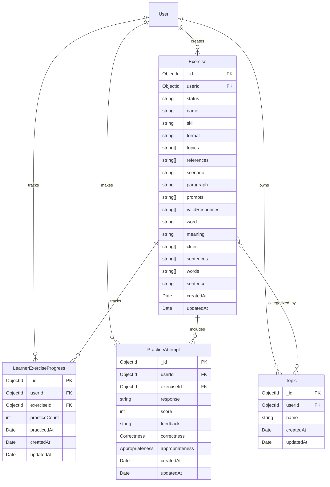

# Practice Module

Database Design document for the Practice module.

## Introduction

This document describes the database schema, indexes, storage details, and initialization scripts for the Practice module.

## ER Diagram

## `exercises` collection

**Description**: Stores reusable practice exercises across communication, vocabulary, and articulation skills. Exercise content is embedded so an exercise can be returned as a single practice payload.

**Schema Definition**:

| Field            | Data Type       | Description                                   | Constraints                                            |
| ---------------- | --------------- | --------------------------------------------- | ------------------------------------------------------ |
| `_id`            | ObjectId        | MongoDB document identifier                   | Primary key, auto-generated                            |
| `userId`         | ObjectId        | User who created the exercise                 | Required, reference to `users`                         |
| `status`         | String          | Exercise lifecycle state                      | Enum: `active`, `archived`; default `active`           |
| `name`           | String          | Exercise name                                 | Required                                               |
| `skill`          | String          | Skill practiced by the exercise               | Enum: `communication`, `vocabulary`, `articulation`    |
| `format`         | String          | Structure of the exercise                     | Enum: `word`, `sentence`, `paragraph`, `communication` |
| `topics`         | Array of String | Topic names used for filtering                | Defaults to `[]`                                       |
| `references`     | Array of String | Links to source material                      | Defaults to `[]`                                       |
| `scenario`       | String          | Situation or task represented by the exercise | Required for `communication` exercises                 |
| `paragraph`      | String          | Paragraph content for a paragraph exercise    | Required for `paragraph` exercises                     |
| `prompts`        | Array of String | Questions or counterpart utterances           | Required for `communication` exercises                 |
| `validResponses` | Array of String | Acceptable learner responses                  | Required for `communication` exercises                 |
| `word`           | String          | Vocabulary word                               | Required for `word` exercises                          |
| `meaning`        | String          | Vocabulary word definition                    | Required for `word` exercises                          |
| `sentences`      | Array of String | Example sentences for a vocabulary word       | Defaults to `[]`; used by `word` exercises             |
| `clues`          | Array of String | Vocabulary clues                              | Defaults to `[]`; used by `word` exercises             |
| `words`          | Array of String | Required words for an articulation response   | Required for `sentence` and `paragraph` exercises      |
| `sentence`       | String          | Reference sentence for a sentence exercise    | Required for `sentence` exercises                      |
| `createdAt`      | Date            | Creation timestamp                            | Required, generated by timestamps                      |
| `updatedAt`      | Date            | Last modification timestamp                   | Required, generated by timestamps                      |

**Exercise content by format**:

| `format`        | Content fields in the example data      |
| --------------- | --------------------------------------- |
| `communication` | `scenario`, `prompts`, `validResponses` |
| `word`          | `word`, `meaning`, `sentences`, `clues` |
| `sentence`      | `sentence`, `words`                     |
| `paragraph`     | `paragraph`, `words`                    |

Fields that do not apply to an exercise format are omitted from the payload. The schema may still define those fields as optional so all formats can share one collection.

**Relationships**:

| Related Collection          | Type                       | Cardinality | Description                                                                            |
| --------------------------- | -------------------------- | ----------- | -------------------------------------------------------------------------------------- |
| `users`                     | Many-to-One                | *..1        | Each exercise has one creator.                                                         |
| `topics`                    | Many-to-Many by topic name | _.._        | An exercise can contain multiple topic names; a topic can classify multiple exercises. |
| `learner_exercise_progress` | One-to-Many                | 1..*        | An exercise can have one progress record per learner.                                  |
| `practice_attempts`         | One-to-Many                | 1..*        | An exercise can include many learner practice attempts.                                |

**Indexes**:

| Fields   | Type  | Purpose                                                                                             |
| -------- | ----- | --------------------------------------------------------------------------------------------------- |
| `topics` | INDEX | Supports filtering exercises by topic.                                                              |
| `status` | INDEX | Recommended for filtering active exercises; the current Mongoose schema does not create this index. |

**Storage Details**:

- Stored in MongoDB collection `exercises` using the default WiredTiger storage engine.
- Exercise content is embedded because it is read with the exercise and is bounded by the exercise document.
- Topic names are denormalized as strings. The `topics` collection provides topic discovery, while the exercise stores the filterable values.
- Mongoose timestamps maintain `createdAt` and `updatedAt`.

## `topics` collection

**Description**: Stores topic labels available for grouping and filtering practice exercises.

**Schema Definition**:

| Field       | Data Type | Description                              | Constraints                       |
| ----------- | --------- | ---------------------------------------- | --------------------------------- |
| `_id`       | ObjectId  | MongoDB document identifier              | Primary key, auto-generated       |
| `userId`    | ObjectId  | User who owns the topic, when applicable | Optional, reference to `users`    |
| `name`      | String    | Topic label                              | Required, indexed, non-unique     |
| `createdAt` | Date      | Creation timestamp                       | Required, generated by timestamps |
| `updatedAt` | Date      | Last modification timestamp              | Required, generated by timestamps |

**Relationships**:

| Related Collection | Type                       | Cardinality | Description                                 |
| ------------------ | -------------------------- | ----------- | ------------------------------------------- |
| `users`            | Many-to-One                | *..1        | A topic may be owned by one user.           |
| `exercises`        | Many-to-Many by topic name | _.._        | A topic name may be used by many exercises. |

**Indexes**:

| Fields | Type  | Purpose                              |
| ------ | ----- | ------------------------------------ |
| `name` | INDEX | Supports topic lookup and filtering. |

**Storage Details**:

- Stored in MongoDB collection `topics` using WiredTiger.
- Topic names are intentionally non-unique at the database level; the collection uses a regular index for lookup and filtering.
- Mongoose timestamps maintain `createdAt` and `updatedAt`.

## `learner_exercise_progress` collection

**Description**: Stores aggregate practice state for one learner and one exercise. It supports ordering practice exercises and showing repetition progress.

**Schema Definition**:

| Field           | Data Type | Description                    | Constraints                        |
| --------------- | --------- | ------------------------------ | ---------------------------------- |
| `_id`           | ObjectId  | MongoDB document identifier    | Primary key, auto-generated        |
| `userId`        | ObjectId  | Learner identifier             | Required, reference to `users`     |
| `exerciseId`    | ObjectId  | Practiced exercise identifier  | Required, reference to `exercises` |
| `practiceCount` | Number    | Number of successful practices | Defaults to `0`                    |
| `practicedAt`   | Date      | Most recent practice timestamp | Defaults to the current date       |
| `createdAt`     | Date      | Creation timestamp             | Generated by timestamps            |
| `updatedAt`     | Date      | Last modification timestamp    | Generated by timestamps            |

**Relationships**:

| Related Collection | Type        | Cardinality | Description                                  |
| ------------------ | ----------- | ----------- | -------------------------------------------- |
| `users`            | Many-to-One | *..1        | Each practice record belongs to one learner. |
| `exercises`        | Many-to-One | *..1        | Each practice record tracks one exercise.    |

**Indexes**:

| Fields                   | Type         | Purpose                                                                                                       |
| ------------------------ | ------------ | ------------------------------------------------------------------------------------------------------------- |
| (`userId`, `exerciseId`) | UNIQUE INDEX | Enforces one aggregate practice record per learner and exercise and supports lookup during practice ordering. |

**Storage Details**:

- Stored in MongoDB collection `learner_exercise_progress` using WiredTiger.
- The compound unique index prevents duplicate counters for the same learner/exercise pair.
- Updates to `practiceCount` and `practicedAt` should be performed atomically for a learner/exercise pair.
- Mongoose timestamps maintain `createdAt` and `updatedAt`.

## `practice_attempts` collection

**Description**: Stores a learner response together with standardized feedback generated by AI. The feedback uses the same overall score, feedback, correctness, and optional appropriateness fields across practice types.

**Schema Definition**:

| Field                           | Data Type         | Description                        | Constraints                                          |
| ------------------------------- | ----------------- | ---------------------------------- | ---------------------------------------------------- |
| `_id`                           | ObjectId          | MongoDB document identifier        | Primary key, auto-generated                          |
| `userId`                        | ObjectId          | Learner who submitted the response | Required, reference to `users`                       |
| `exerciseId`                    | ObjectId          | Exercise being answered            | Required, reference to `exercises`                   |
| `response`                      | String            | Learner's submitted response       | Required                                             |
| `score`                         | Number            | Overall evaluation score           | Required; application scores responses from 0 to 100 |
| `feedback`                      | String            | Overall evaluation feedback        | Required                                             |
| `correctness`                   | Embedded document | Answer or response correctness     | Required                                             |
| `correctness.score`             | Number            | Correctness score                  | Required                                             |
| `correctness.feedback`          | String            | Correctness explanation            | Required                                             |
| `correctness.fixes`             | Array of String   | Suggested corrections              | Optional; defaults to `[]`                           |
| `correctness.correctedSentence` | String            | Corrected sentence                 | Optional                                             |
| `appropriateness`               | Embedded document | Contextual or task suitability     | Optional                                             |
| `appropriateness.score`         | Number            | Appropriateness score              | Required when `appropriateness` is present           |
| `appropriateness.feedback`      | String            | Appropriateness explanation        | Required when `appropriateness` is present           |
| `appropriateness.clarity`       | Embedded document | Clarity evaluation                 | Optional; communication practice only                |
| `appropriateness.politeness`    | Embedded document | Politeness evaluation              | Optional; communication practice only                |
| `appropriateness.tone`          | Embedded document | Tone evaluation                    | Optional; communication practice only                |
| `createdAt`                     | Date              | Practice attempt timestamp         | Required, generated by timestamps                    |
| `updatedAt`                     | Date              | Last modification timestamp        | Required, generated by timestamps                    |

**Relationships**:

| Related Collection | Type        | Cardinality | Description                                   |
| ------------------ | ----------- | ----------- | --------------------------------------------- |
| `users`            | Many-to-One | *..1        | Each practice attempt belongs to one learner. |
| `exercises`        | Many-to-One | *..1        | Each practice attempt answers one exercise.   |

**Indexes**:

| Fields                   | Type  | Purpose                                                        |
| ------------------------ | ----- | -------------------------------------------------------------- |
| (`userId`, `exerciseId`) | INDEX | Supports a learner's practice-attempt history for an exercise. |
| `createdAt` descending   | INDEX | Supports recent practice-attempt queries.                      |

**Storage Details**:

- Stored in MongoDB collection `practice_attempts` using WiredTiger.
- Evaluation details are embedded because they are created and read as one immutable evaluation result.
- `correctness` and `appropriateness` use the same structure across practice types; communication-only subfields are optional.
- Mongoose timestamps maintain `createdAt` and `updatedAt`.

## Scripts

- Init MongoDB replica set: `apps/db/init-rs.js`
- Seed initial data: `apps/db/seed.js`

## Changelog

| Version | Date       | Changes                                                                                                                                                                                                                             |
| ------- | ---------- | ----------------------------------------------------------------------------------------------------------------------------------------------------------------------------------------------------------------------------------- |
| 1.0     | 2026-08-14 | Initial Practice data model for exercise retrieval, practice tracking, and response evaluation.                                                                                                                                     |
| 1.1     | 2026-09-07 | Aligned the model with the implemented MongoDB schemas: embedded prompts, valid responses, and evaluation details; removed unregistered prompt and evaluation collections; documented collection-level indexes and storage details. |
| 1.2     | 2026-09-25 | Renamed the response submission collection to `practice_attempts` to clarify that each learner attempt is stored with its evaluation.                                                                                               |
