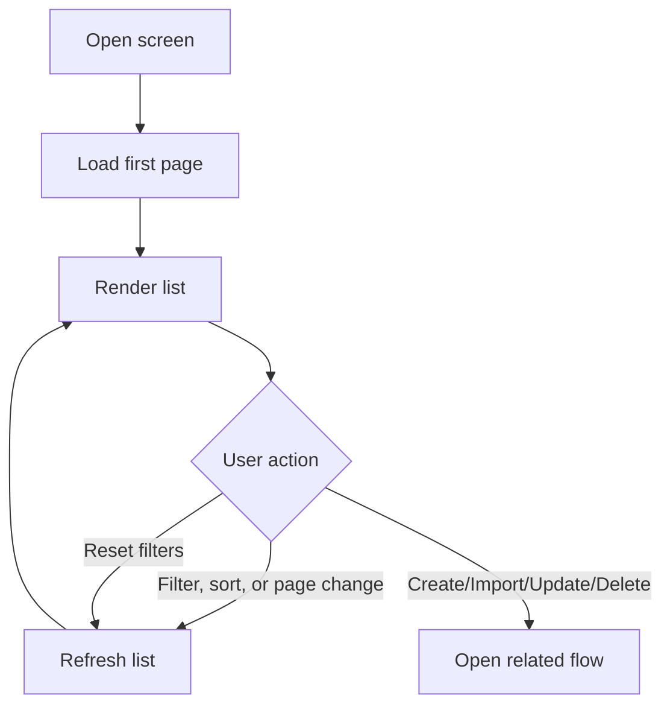

# View My Exercises

## Introduction

- **Description:** Users can view and find their exercises in a single list.
- **User Goal:** Find the right exercise quickly and move into create, update, delete, or import flows.
- **Related Features:** Create exercise, update exercise, delete exercise, import exercises.

## User Story

- As a user, I want to filter and sort my exercise list so that I can find the right item quickly.

## Scope

### Inclusions

- Find and manage exercises in one list.

### Exclusions

- Free-text search across multiple fields.
- Client-side filtering of a full dataset.
- State persistence across reloads or page changes.
- Inline editing in the list.
- Bulk actions.

## Dependencies

- Authenticated user account.
- Exercise list API.

## User Flow

## Acceptance Criteria

- The table includes Scenario, Topics, Date Created, Status, and Actions.
- The Actions column includes Update and Delete.
- Create and Import buttons are available in the toolbar.
- Empty state appears when no results match.
- Mobile-first layout uses smaller padding, margin, and text sizes than desktop.
- Filter state is not preserved after reload or navigation.
- Every list query returns only the authenticated user's exercises, regardless of filters, sorting, or pagination.

### Filtering Requirements

- Backend API filters by name, topics, skills, formats, and status.
- Name matching is case-insensitive contains.
- Topic, skill, format, and status filters are multi-select with OR matching within each filter.
- Different filters are combined with AND logic.
- Topic options come from the API; skill and format options are fixed application values.
- Changing any filter immediately refreshes results through the backend API.
- Reset clears all filters and immediately refreshes results.

### Sorting Requirements

- Backend API sorts by name and Date Created; multiple sort columns are supported, with earlier selections taking priority.
- Changing sorting immediately refreshes results.

### Pagination Requirements

- Backend API handles pagination; changing page size or index immediately refreshes results.
- Cancel in-flight requests when filters, sorting, page size, or page index change.

## Related Documents

- [Exercise List Screen](../../design/web/manage/exercise-list.md)
- [Find Exercises API](../../design/api/manage/find-exercises.md)
