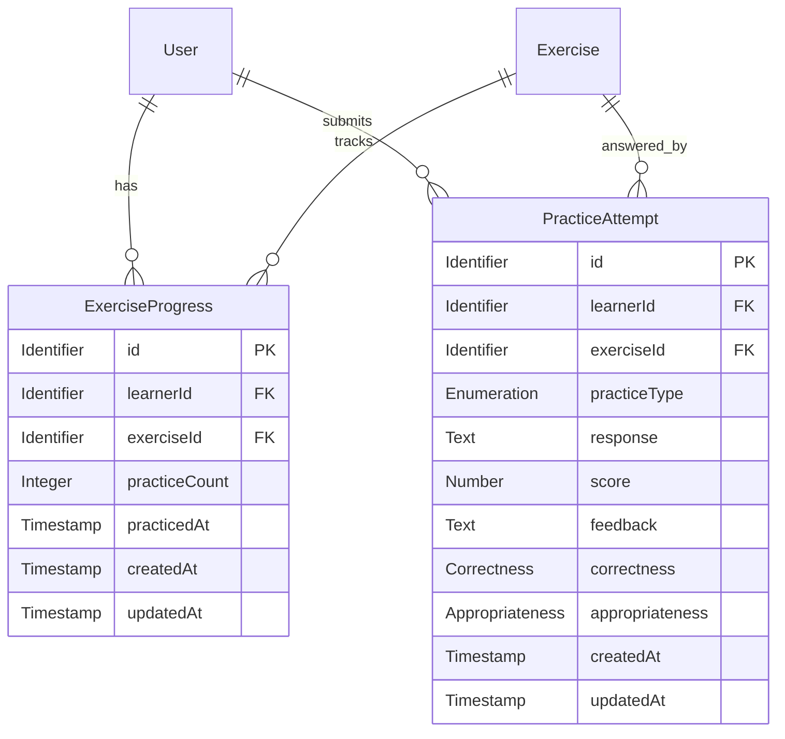

# Practice Data Specification

## Introduction

The practice module presents active exercises to learners, evaluates submitted responses, and tracks practice history and progress.

This document defines the business meaning, data structure, allowed values, and validation rules for practice data.

Exercise fields, content, and skill-format compatibility are defined in the [core data specification](../../core/spec/data.md#exercise).

## Assumptions

1. Learner identity comes from the authenticated account; learners cannot submit for another user.
2. Only active exercises may be practiced.
3. Every accepted submission produces a distinct attempt with its evaluation. A saved attempt counts as a completed practice, regardless of its score.
4. Progress is aggregated independently for each learner and exercise. A learner with no practice history has a count of zero and no practice timestamp.
5. Timestamps use UTC.

## Entity-Relationship Diagram

The core module owns `Exercise` data and content. The manage module provides user-facing features for creating and maintaining exercises; the practice module reads active exercise content and does not own or modify it.

## Exercise Progress

Represents a learner's aggregate history for one exercise. It is used to show practice count and most recent practice time and to help select exercises.

| Name                      | ID              | Type       | Constraints                                    | Default          | Description                                                              |
| ------------------------- | --------------- | ---------- | ---------------------------------------------- | ---------------- | ------------------------------------------------------------------------ |
| Progress ID               | `id`            | Identifier | Required, Unique                               | —                | Stable identifier for the aggregate progress record.                     |
| Learner ID                | `learnerId`     | Identifier | Required, UserOwnership, LearnerExerciseUnique | —                | Learner whose progress is tracked.                                       |
| Exercise ID               | `exerciseId`    | Identifier | Required, ExerciseAvailable                    | —                | Exercise associated with the progress record.                            |
| Practice Count            | `practiceCount` | Integer    | Required, NonNegative                          | `0`              | Number of accepted, evaluated submissions for this learner and exercise. |
| Most Recent Practice Time | `practicedAt`   | Timestamp  | ProgressUpdate                                 | —                | Time of the learner's most recent completed practice.                    |
| Creation Time             | `createdAt`     | Timestamp  | Required                                       | System generated | Time the progress record was created.                                    |
| Update Time               | `updatedAt`     | Timestamp  | Required                                       | System generated | Time the progress record was last changed.                               |

There is at most one progress record for a learner-exercise pair. Before the first practice, `practicedAt` is not persisted; a missing progress record is presented as `practiceCount: 0` and `practicedAt: null`.

## Practice Attempt

A collection of exercise submissions and feedback.

Here're common fields for each practice attempt:

| Name          | ID             | Type                        | Constraints                 | Default          | Description                                               |
| ------------- | -------------- | --------------------------- | --------------------------- | ---------------- | --------------------------------------------------------- |
| Attempt ID    | `id`           | Identifier                  | Required, Unique            | —                | Stable identifier for this submission and its evaluation. |
| Learner ID    | `learnerId`    | Identifier                  | Required, UserOwnership     | —                | Authenticated learner who submitted the response.         |
| Exercise ID   | `exerciseId`   | Identifier                  | Required, ExerciseAvailable | —                | Exercise being answered.                                  |
| Practice Type | `practiceType` | Practice Type (Enumeration) | Required, PracticeType      | —                | Activity used to select the matching evaluation method.   |
| Response      | `response`     | Text                        | Required, NonEmpty          | —                | Learner's submitted answer.                               |
| Score         | `score`        | Number                      | Required, ScoreRange        | —                | Overall evaluation score.                                 |
| Feedback      | `feedback`     | Text                        | Required, NonEmpty          | —                | Overall feedback for the submission.                      |
| Creation Time | `createdAt`    | Timestamp                   | Required                    | System generated | Time the response was submitted and evaluated.            |
| Update Time   | `updatedAt`    | Timestamp                   | Required                    | System generated | Time the attempt record was last changed.                 |

### Correctness Evaluation

Additional fields for correctness evaluation:

| Name                     | ID                                          | Type         | Constraints                   | Default | Description                                                                              |
| ------------------------ | ------------------------------------------- | ------------ | ----------------------------- | ------- | ---------------------------------------------------------------------------------------- |
| Correctness Score        | `correctness.score`                         | Number       | ScoreRange, FeedbackFields    | —       | Correctness score for the full response.                                                 |
| Correctness Feedback     | `correctness.feedback`                      | Text         | NonEmpty, FeedbackFields      | —       | Explanation of the full response's correctness result.                                   |
| Grammar & Spelling Fixes | `correctness.fixes`                         | List of Text | NonEmptyItems, FeedbackFields | —       | Suggested grammar or spelling corrections; empty when none are needed.                   |
| Corrected Sentence       | `correctness.correctedSentence`             | Text         | FeedbackFields                | —       | Corrected version of the full response; empty when no correction is needed.              |
| Sentence to evaluate     | `correctness.sentences[].sentence`          | Text         | NonEmpty, FeedbackFields      | —       | Sentence from the response being evaluated.                                              |
| Sentence Score           | `correctness.sentences[].score`             | Number       | ScoreRange, FeedbackFields    | —       | Correctness score for this sentence.                                                     |
| Sentence Feedback        | `correctness.sentences[].feedback`          | Text         | NonEmpty, FeedbackFields      | —       | Explanation of this sentence's correctness result.                                       |
| Sentence Fixes           | `correctness.sentences[].fixes`             | List of Text | NonEmptyItems, FeedbackFields | —       | Suggested grammar or spelling corrections for this sentence; empty when none are needed. |
| Corrected Sentence       | `correctness.sentences[].correctedSentence` | Text         | FeedbackFields                | —       | Corrected version of this sentence; empty when no correction is needed.                  |

### Appropriateness Evaluation

Additional fields for appropriateness evaluation:

| Name                     | ID                                    | Type   | Constraints                | Default | Description                 |
| ------------------------ | ------------------------------------- | ------ | -------------------------- | ------- | --------------------------- |
| Appropriateness Score    | `appropriateness.score`               | Number | ScoreRange, FeedbackFields | —       | Appropriateness score.      |
| Appropriateness Feedback | `appropriateness.feedback`            | Text   | NonEmpty, FeedbackFields   | —       | Explanation of suitability. |
| Clarity Score            | `appropriateness.clarity.score`       | Number | ScoreRange, FeedbackFields | —       | Clarity score.              |
| Clarity Feedback         | `appropriateness.clarity.feedback`    | Text   | NonEmpty, FeedbackFields   | —       | Clarity feedback.           |
| Politeness Score         | `appropriateness.politeness.score`    | Number | ScoreRange, FeedbackFields | —       | Politeness score.           |
| Politeness Feedback      | `appropriateness.politeness.feedback` | Text   | NonEmpty, FeedbackFields   | —       | Politeness feedback.        |
| Tone Score               | `appropriateness.tone.score`          | Number | ScoreRange, FeedbackFields | —       | Tone score.                 |
| Tone Feedback            | `appropriateness.tone.feedback`       | Text   | NonEmpty, FeedbackFields   | —       | Tone feedback.              |

## Enumerations

### Practice Type

| Value                   | Label                 | Description                                               |
| ----------------------- | --------------------- | --------------------------------------------------------- |
| `communication`         | Communication         | Respond to a prompt in a real-life conversation.          |
| `using-word`            | Using Word            | Write a sentence using the target word or phrase.         |
| `word-guessing`         | Word Guessing         | Guess a target word or phrase from its meaning.           |
| `just-one-word`         | Just One Word         | Guess a target word or phrase from clues.                 |
| `sentence-construction` | Sentence Construction | Construct a sentence using the provided words or phrases. |
| `sentence-variation`    | Sentence Variation    | Rewrite a sentence while preserving its meaning.          |
| `paragraph-variation`   | Paragraph Variation   | Rewrite a paragraph while preserving its meaning.         |

Allowed practice types depend on the exercise's skill and format:

| Skill           | Format          | Allowed practice types                         |
| --------------- | --------------- | ---------------------------------------------- |
| `communication` | `communication` | `communication`                                |
| `vocabulary`    | `word`          | `using-word`, `word-guessing`, `just-one-word` |
| `articulation`  | `sentence`      | `sentence-construction`, `sentence-variation`  |
| `articulation`  | `paragraph`     | `paragraph-variation`                          |

## Constraints

Enumeration-typed fields accept only values listed under their enumeration.

| Rule ID               | Trigger                                 | Business Rule                                                                                             | Violation                                                          |
| --------------------- | --------------------------------------- | --------------------------------------------------------------------------------------------------------- | ------------------------------------------------------------------ |
| Required              | When a record is created or updated     | Field must be present in the object; it cannot be `undefined` or `null`.                                  | Reject the record and identify the omitted field.                  |
| Unique                | When assigning a record identifier      | An entity's identifier must identify only one record.                                                     | Reject the record.                                                 |
| NonEmpty              | When value is supplied                  | Value must contain a non-whitespace character after trimming.                                             | Reject the value and identify the field.                           |
| NonEmptyItems         | When a list value is supplied           | Every list item must not be empty after trimming;                                                         | Reject non-text items or blank items.                              |
| UserOwnership         | On submission or progress lookup/update | A learner may submit responses and access progress only under their authenticated identity.               | Reject or hide access outside the learner's scope.                 |
| ExerciseAvailable     | When a response is submitted            | The referenced exercise must exist and be active.                                                         | Reject the submission as unavailable.                              |
| LearnerExerciseUnique | When progress is created or updated     | Keep at most one aggregate progress record per learner-exercise pair.                                     | Update the existing aggregate instead of creating a duplicate.     |
| ScoreRange            | When an evaluation is recorded          | All overall and evaluation scores must be numeric and between 0 and 100 inclusive.                        | Reject the invalid evaluation value.                               |
| NonNegative           | When progress is updated                | Practice count must be a whole number greater than or equal to zero.                                      | Reject the invalid count.                                          |
| ProgressUpdate        | After an attempt is successfully stored | On successful attempt, increment count and set `practicedAt` to completion time together.                 | Do not report progress updated unless both values are persisted.   |
| PracticeType          | When a response is submitted            | Value must be compatible with exercise's format, see "Format-Practice Compatibility" table below.         | Reject the submission and identify the incompatible practice type. |
| FeedbackFields        | When evaluation details are recorded    | Field must be present (defined) based on Practice Type value, see "Practice-Specific Fields" table below. | Reject incomplete or unsupported evaluation data.                  |

### Format-Practice Compatibility

| Exercise Format | Allowed Practice Types                         |
| --------------- | ---------------------------------------------- |
| `communication` | `communication`                                |
| `word`          | `using-word`, `word-guessing`, `just-one-word` |
| `sentence`      | `sentence-construction`, `sentence-variation`  |
| `paragraph`     | `paragraph-variation`                          |

### Practice-Specific Fields

Applicable fields per practice type (unknown fields are stripped duirng validation):

| Practice type           | Required fields                                                                                                          |
| ----------------------- | ------------------------------------------------------------------------------------------------------------------------ |
| `communication`         | `correctness.{score,feedback,fixes,correctedSentence}`; `appropriateness.{score,feedback,clarity.*,politeness.*,tone.*}` |
| `using-word`            | `correctness.{score,feedback,fixes,correctedSentence}`; `appropriateness.{score,feedback}`                               |
| `sentence-construction` | `correctness.{score,feedback,fixes,correctedSentence}`; `appropriateness.{score,feedback}`                               |
| `sentence-variation`    | `correctness.{score,feedback,fixes,correctedSentence}`; `appropriateness.{score,feedback}`                               |
| `paragraph-variation`   | `correctness.{score,feedback,sentences}`; `appropriateness.{score,feedback}`                                             |
| `just-one-word`         | None                                                                                                                     |
| `word-guessing`         | None                                                                                                                     |

For correctness evaluations, `fixes` can be empty list and `correctedSentence` can be an empty string when no correction are needed.

## Revision History

| Version | Date       | Author       | Changes                                                                                     |
| ------- | ---------- | ------------ | ------------------------------------------------------------------------------------------- |
| 1.0     | 2026-10-07 | Fluento team | Initial practice data specification based on existing project requirements and data design. |
| 1.1     | 2026-10-09 | Fluento team | Aligned shared constraint definitions and triggers with the core data specification.        |
| 1.2     | 2026-10-10 | Fluento team | Allow empty correctness fixes and corrected sentences while requiring applicable fields.    |
