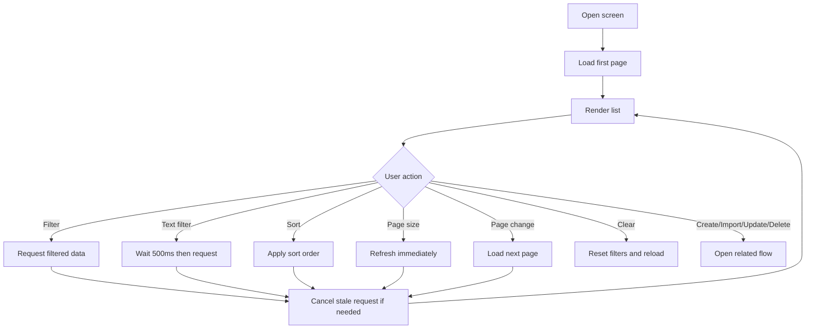

# List Exercises

## Introduction

- **Description:** Users can view and find their exercises in a single list.
- **User Goal:** Find the right exercise quickly and move into create, update, delete, or import flows.
- **Related Features:** Create exercise, update exercise, delete exercise, import exercises.

## User Story

- As a user, I want to filter and sort my exercise list so that I can find the right item quickly.
- As a user, I want the list to update immediately when I change filters.
- As a user, I want a clear button and a collapsed filter panel so that I can reset or hide filters easily.
- As a user, I want the screen to work well on mobile devices with smaller spacing and typography.

## Scope

### Inclusions

- Show exercises for the current user in a table.
- Filter panel is collapsed by default and can be opened or closed.
- Live filtering by scenario, topics, and status.
- Scenario text filter uses a 500 ms debounce before refreshing the list.
- Sorting by clicking column headers: asc → desc → clear.
- Multi-column sorting with later selections having lower priority.
- Immediate list refresh when changing page size.
- Clear button resets all filter controls.
- Server-side pagination, filtering, and sorting.
- Update and delete actions per row.
- Create and import actions in the toolbar.
- Empty state when no results match.
- Mobile-first responsive layout.

### Exclusions

- Free-text search across multiple fields.
- Client-side filtering of a full dataset.
- State persistence across reloads or page changes.
- Inline editing in the list.
- Bulk actions.

## Dependencies

- Authenticated user account.
- Backend API for paginated, filtered, and sorted exercise queries.
- API for retrieving the topic list used in the topic filter.

## User Flow

1. Open the exercise management screen.
2. The system loads the first page of exercises from the server.
3. The filter panel is collapsed by default but can be expanded.
4. Change a filter or sort option; the list refreshes immediately.
5. The scenario text field waits 500 ms after the last keystroke before requesting new data.
6. Click a column header to sort asc, then desc, then clear.
7. Add multiple sort columns; earlier selections have higher priority.
8. Change page size; the list updates immediately.
9. Click Clear to reset all filters.
10. Move through pages using server-driven pagination.
11. Open create, import, update, or delete flows from the list.

## Acceptance Criteria

- The authenticated user sees only their own exercises.
- The table includes Scenario, Topics, Date Created, Status, and Actions.
- The Actions column includes Update and Delete.
- The filter panel is collapsed by default and can be toggled.
- Filters update the list immediately.
- Scenario text filter has a debounce of 500 ms.
- Topic filter uses a multi-select dropdown matching any selected topic.
- Status filter uses a single-select dropdown.
- Page-size changes update the list immediately.
- Clear resets all filters in one action.
- Column header clicks cycle asc → desc → clear.
- Multiple sort columns are supported; earlier selections have higher priority.
- The app does not preserve filter state after reload or navigation.
- Old in-flight requests are cancelled when filters or page settings change.
- Filtering, sorting, and pagination are handled by the server.
- Create and Import buttons are available in the toolbar.
- Empty state appears when no results match.
- Mobile-first layout uses smaller padding, margin, and text sizes than desktop.

## Alternate Flows

- If no records match, show an empty state and let the user clear filters.
- If a request is still loading and the user changes filters, cancel it and load the latest state.
- If the user changes page size or page while loading, cancel the stale request and fetch the latest result.
- If the user clicks a sort header repeatedly, the sort cycles asc → desc → clear.

## Edge Cases

- Rapid typing in the scenario field.
- Changing multiple filters quickly.
- Clicking sort headers repeatedly.
- Changing page size while data is loading.
- Clearing filters while a request is in flight.

## Business Rules

- Only the current user can access and manage their exercises.
- All filtering, sorting, and pagination are server-side.
- Scenario matching is case-insensitive contains.
- Topic match is any selected topic.
- Sort order is explicit and column-specific.
- Earlier selected sort columns take precedence over later ones.
- Clear resets all filter values to defaults.
- No filter state is retained across reloads or route changes.

## Non-Functional Requirements

- Updates should feel immediate and not require page reloads.
- Stale requests must be cancelled to avoid outdated results.
- Controls and table data must remain clear and accessible.
- The layout must be mobile-first and adapt to larger screens.
