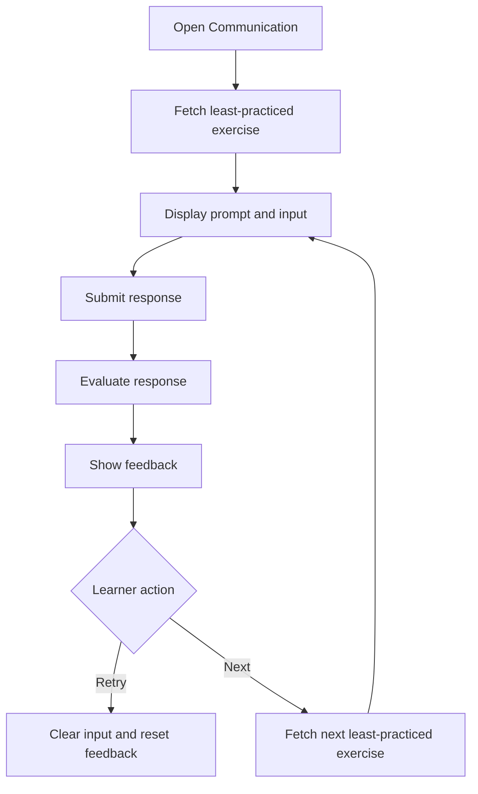

# Practice Communication

## Introduction

- **Description:** Learners practice realistic conversations and get instant feedback.
- **User Goal:** Build confidence and fluency in everyday communication.

## User Story

- As a learner, I want to simulate realistic conversations so that I can improve my communication skills.

## Scope

### Inclusions

- Access the Communication section from the app menu.
- Fetch and show a practice prompt.
- Let learners type and submit a response.
- Evaluate the response and show feedback.
- Support retry and next-exercise flow.
- Avoid repeated exercises for 24 hours.

### Exclusions

- Real-time tutoring or peer chat.
- Voice recording or pronunciation scoring.
- Leaderboards or community challenges.

## Dependencies

- Learner account for personalized exercise tracking.
- Feedback service (using AI) to score learner responses.
- Technology for synchronizing practiced exercises between client apps.

## User Flow

1. The learner opens the Communication section from the app menu.
2. The app loads the Practice Communication screen and fetches the least-practiced available exercises.
3. The screen displays the selected scenario prompt, role context, and response input area.
4. The learner types a response and submits it.
5. The app sends the response to the backend for evaluation.
6. The app displays feedback, including an overall score, suggested corrections, and example responses.
7. The learner can either retry the same exercise or move to a new one.

Note: practice count is per learner; the same exercise can be practiced by multiple learners with different counts.



## Acceptance Criteria

- The app shows the Practice Communication screen when selected.
- The app fetches exercises in least-practiced order, one at a time.
- The prompt includes scenario context, counterpart text, and input area.
- The app validates the learner response before sending it.
- The app shows feedback with a score and actionable suggestions.
- The learner can retry after evaluation, and the box resets.
- The learner can move to the next exercise if it is new.
- The app tracks exercise IDs for 24 hours to avoid repeats.
- If no exercise is available, the app shows an empty state.
- If the backend fails, the app shows a retry message.

## Alternate Flows

### Learner submits an empty response

- The app prevents submission and shows a validation message such as "Please enter a response before submitting".
- The learner can keep typing and submit again.

### Exercise fetch returns no results

- The app shows an empty state when no exercises are available.
- The learner can retry later or switch to another learning module.

### Backend evaluation fails or times out

- The app keeps the response and shows an error message.
- The learner can retry without losing typed text.

### Duplicate exercise selection

- If an exercise is already practiced, the app skips it.
- The learner does not see it again until the TTL expires.

## Edge Cases

- The learner submits only whitespace or very short text.
- The learner double-taps submit; the app blocks duplicates.
- Exercise data is missing required fields.
- The learner leaves during evaluation and returns later.
- The TTL expires after 24 hours; the exercise becomes eligible again.
- The learner changes devices; recent state remains synced.
- All returned exercises are already practiced; the app still selects the least-practiced one.

## Exercise Selection Logic

The app tracks previously shown exercise IDs for the current learner within the same 24-hour period.

After fetching exercises, the app gets the first exercise that is not in the current learner's practiced set to avoid repeating the same exercise.

If all fetched exercises are in the practiced set, the app picks the first one (accept repetition rather than showing nothing).

## Getting Feedback

Prompt sent to AI for getting feedback on learner's response:

```md
## Task

Review my sentence and give feedback for correctness and relevance to the provided prompt.

## Inputs

- **Prompt:** _Politely request to your friend to take you to the airport_
- **Sentence:** "I was hoping you could give me a lift to the airport"

## Feedback structure

Feedback includes:

- **Feedback**: overall feedback
- **Correctness**: check spelling & grammar of learner's response
  - **Score** (x/100)
  - **Feedback**: correctness feedback
  - **Grammar/spelling fixes**
  - **Corrected sentence**
- **Appropriateness**: check response is relevant with the prompt
  - **Score** (x/100): `0` if the response is irrelevant with the prompt, otherwise it's the average of clarity, politeness, and tone scores.
  - **Clarity**: Is the response easy to understand and free of ambiguity?
    - **Score** (x/100)
    - **Feedback**
  - **Politeness**: Does it show courtesy or acknowledge the other person?
    - **Score** (x/100)
    - **Feedback**
  - **Tone**: Does the emotional tone fit the situation (friendly, professional, humorous)?
    - **Score** (x/100)
    - **Feedback**
```
