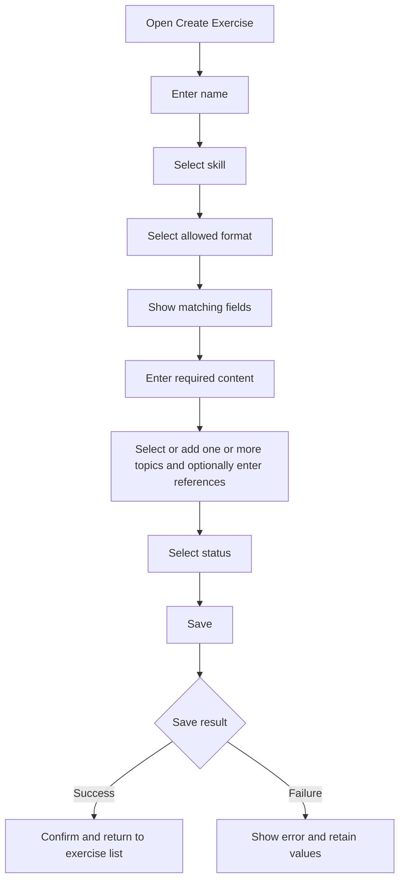

# Create Exercise

## Introduction

- **Description:** Create an exercise for a chosen skill and format.
- **User Goal:** Add practice content with the fields its format requires.
- **Related Features:** View, update, and delete exercises.

## User Story

- As a user, I want to choose a skill and format so I can enter the right practice content.

## Scope

### Inclusions

- Choose a skill and a supported format.
- Enter a name and format-specific content.
- Add one or more topics and optionally add references.
- Select a status.

### Exclusions

- Importing, updating, or deleting exercises.
- Creating or managing topics.
- Automatically generating exercise content.

## Dependencies

- Authenticated user account.
- Create Exercise API.
- Find Topics API for topic options.

## User Flow

## Acceptance Criteria

- Require a name, skill, and format supported by that skill.
- Hide Format until a skill is selected.
- When Skill changes, clear Format and format-specific values, then show valid formats.
- Show only fields for the selected format.
- Block saving if required values are missing or whitespace-only.
- Let the user select `active` or `archived`; default to `active`.
- Require at least one topic.
- Save the selected status and associate the exercise with the authenticated user.
- On success, confirm creation and return to the exercise list.
- On failure, show an actionable error, retain values, and allow retry.
- Support keyboard use, visible labels, and accessible validation and status messages.

## Form Requirements

### Common Fields

| Field      | Requirement                                                         |
| ---------- | ------------------------------------------------------------------- |
| Name       | Required; non-empty exercise name.                                  |
| Skill      | Required: `communication`, `vocabulary`, or `articulation`.         |
| Format     | Required; limited to formats for the selected skill.                |
| Topics     | Required; select existing values or add one or more new ones.      |
| References | Optional source links, one per line.                                |
| Status     | Required: `active` or `archived`; default `active`.                 |

### Format-Specific Fields

- Enter string arrays in textareas, one value per line. Use a creatable multi-select for topics.
- Show only fields available for the selected format; required and optional fields follow the [manage data specification](./data.md#exercise).
- References are optional; each required list needs at least one non-empty line.
- On submit, remove empty or whitespace-only lines before validation; users need not remove them manually.
- Validate required lists after cleanup; each must retain at least one value.
- Include only fields for the selected format in the create request.
- Keep format-specific values only while that format remains selected; clear them when Skill or Format changes.

## Save and Error Handling

- Send common fields, selected format, and only its content to Create Exercise API.
- Include one or more selected topics (including new values) and references; use an empty references list if omitted.
- Prevent duplicate submissions while saving.
- For validation errors, identify fields and retain entered values.
- For API or network errors, show retry and retain values.
- If topics fail to load, explain the issue and allow manual topic entry; require at least one topic before creation.

## Related Documents

- [Database Design](../../design/data.md)
- [Find Topics API](../../design/api/manage/find-topics.md)
