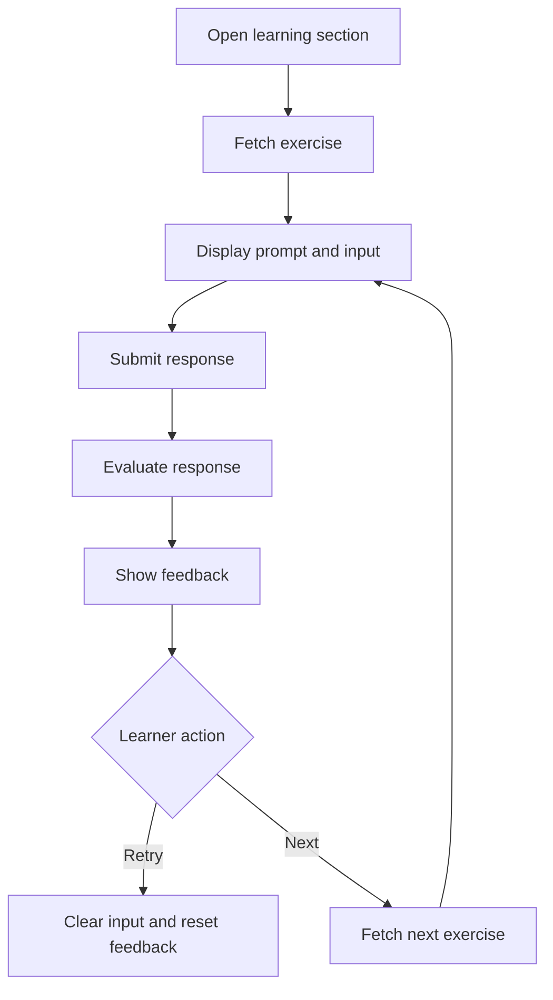

# Submit Exercise Response

## Introduction

- **Description:** Allow learners to submit a response for any exercise and receive immediate, actionable feedback.
- **User Goal:** Complete practice exercises, understand performance, and improve through feedback.

## User Story

- As a learner, I want to submit my response to an exercise so that I can see how well I performed and how to improve.

## Scope

### Inclusions

- Access a practice exercise from the relevant learning section.
- Fetch and show one exercise and its response requirements.
- Let learners provide and submit a response using the input supported by the exercise.
- Evaluate the response and show feedback.
- Support retry and next-exercise flow.

### Exclusions

- Real-time tutoring or peer chat.
- Leaderboards or community challenges.

## Dependencies

- Learner account for personalized exercise tracking.
- Exercise service that provides prompts and response requirements.
- Feedback service (using AI) to evaluate learner responses.

## User Flow

1. The learner opens a learning section from the app menu.
2. The app loads the practice screen and fetches an exercise to complete.
3. The screen displays the selected exercise prompt, context, and response input area.
4. The learner types a response and submits it.
5. The app sends the response to the backend for evaluation.
6. The app displays feedback, including an overall score, actionable suggestions, and exercise-appropriate examples or corrections.
7. The learner can either retry the same exercise or move to a new one.



## Acceptance Criteria

- The app shows the practice screen when the learner selects an exercise-based learning section.
- The app fetches one exercise at a time.
- The prompt includes the exercise context and the input area required for that exercise.
- The app validates the learner response before sending it.
- The app submits a valid response for every supported exercise type.
- The app shows feedback with an overall score and actionable suggestions appropriate to the exercise type.
- The learner can retry after evaluation, and the response input resets.
- The learner can move to the next exercise if it is new.
- If no exercise is available, the app shows an empty state.
- If the backend fails, the app shows a retry message.

## Alternate Flows

### Learner submits an empty response

- The app prevents submission and shows a validation message such as "Please enter a response before submitting".
- The learner can keep typing and submit again.

### Exercise fetch returns no results

- The app shows an empty state when no exercises are available.
- The learner can retry later or switch to another learning module.

### Backend evaluation fails or times out

- The app keeps the response and shows an error message.
- The learner can retry without losing typed text.

## Edge Cases

- The learner submits only whitespace or very short text.
- The learner double-taps submit; the app blocks duplicates.
- Exercise data is missing required fields.
- The learner leaves during evaluation and returns later.
- The learner changes devices; recent state remains synced.

## Exercise Selection Logic

For each exercise, the app tracks the last time it was practiced. The selection logic prioritizes exercises that have not been practiced recently.

The app fetches exercises from the backend API, which supports sorting by `practicedAt` (descending) and filtering by topic.

## Feedback Model

The backend returns standardized feedback for every exercise type. The response includes an overall `score` and learner-facing `feedback`; exercise-specific evaluation categories are optional and may be populated according to the exercise type.

```json
{
  "score": 95,
  "feedback": "Your response is clear, polite, and appropriate for the scenario.",
  "correctness": {
    "score": 95,
    "feedback": "The response is grammatically correct, with one minor contraction improvement.",
    "fixes": ["Use 'I am' instead of 'I'm' in a formal context."],
    "correctedResponse": "I am pleased to confirm that we can proceed."
  },
  "appropriateness": {
    "score": 95,
    "feedback": "The response is relevant to the prompt and matches the expected tone.",
    "clarity": {
      "score": 96,
      "feedback": "The message is easy to understand and free of ambiguity."
    },
    "politeness": {
      "score": 97,
      "feedback": "The response is courteous and respectful."
    },
    "tone": {
      "score": 94,
      "feedback": "The tone is appropriate for this conversation."
    }
  }
}
```

- `score` is the overall score from 0 to 100.
- `feedback` is the overall learner-facing feedback.
- `correctness` evaluates whether the response is accurate and well-formed when applicable.
- `appropriateness` evaluates whether the response fits the exercise goal when applicable.
- `clarity`, `politeness`, and `tone` are optional fields used for communication exercises.
- `fixes` and `correctedResponse` are optional and apply only when a correction is useful.
- Other exercise types may provide additional evaluation fields appropriate to their learning goal.
