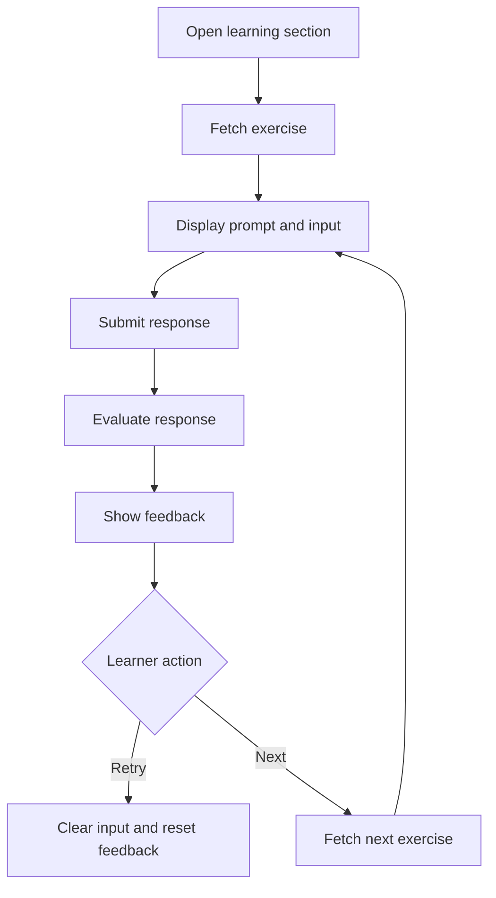

# Submit Exercise Response

## Introduction

- **Description:** Allow learners to submit a response for any exercise and receive immediate, actionable feedback.
- **User Goal:** Complete practice exercises, understand performance, and improve through feedback.

## User Story

- As a learner, I want to submit my response to an exercise so that I can see how well I performed and how to improve.

## Scope

### Inclusions

- Access a practice exercise from the relevant learning section.
- Fetch and show one exercise and its response requirements.
- Let learners provide and submit a response using the input supported by the exercise.
- Evaluate the response and show feedback.
- Support retry and next-exercise flow.

### Exclusions

- Real-time tutoring or peer chat.
- Leaderboards or community challenges.

## Dependencies

- Learner account for personalized exercise tracking.
- Exercise service that provides prompts and response requirements.
- Feedback service (using AI) to evaluate learner responses.

## User Flow

1. The learner opens a learning section from the app menu.
2. The app loads the practice screen and fetches an exercise to complete.
3. The screen displays the selected exercise prompt, context, and response input area.
4. The learner types a response and submits it.
5. The app sends the response to the backend for evaluation.
6. The app displays feedback, including an overall score, actionable suggestions, and exercise-appropriate examples or corrections.
7. The learner can either retry the same exercise or move to a new one.



## Feedback Model

Each exercise type has its own specific feedback structure.

### Communication

**Feedback Structure**:

- `score`: overall score.
- `feedback`: overall feedback.
- `correctness`: score, feedback, grammar or spelling fixes, and an optional corrected response.
- `appropriateness`: score and feedback about relevance to the prompt and scenario.
  - `clarity`: whether the message is easy to understand.
  - `politeness`: whether the response is courteous and respectful.
  - `tone`: whether the tone fits the conversation.

**AI prompt**:

```md
## Task

Review the learner's response to the conversation prompt and give feedback on correctness and appropriateness.

## Inputs

- **Practice**: Communicate in a real-life conversation.
- **Scenario:** Answer small talk questions
- **Topics:** Everyday Conversation
- **Prompt:** "What are you up to this weekend?"
- **Learner Response:** "My parents are coming to visit. What about you?"
```

**Example**:

```json
{
  "score": 95,
  "feedback": "Your response is clear, polite, and appropriate for the scenario.",
  "correctness": {
    "score": 100,
    "feedback": "The response is grammatically correct.",
    "correctedSentence": "",
    "fixes": []
  },
  "appropriateness": {
    "score": 95,
    "feedback": "The response is relevant to the prompt and matches the expected tone.",
    "clarity": {
      "score": 96,
      "feedback": "The message is easy to understand and free of ambiguity."
    },
    "politeness": {
      "score": 97,
      "feedback": "The response is courteous and respectful."
    },
    "tone": {
      "score": 94,
      "feedback": "The tone is appropriate for this conversation."
    }
  }
}
```

### Using Word

**Feedback Structure**:

- `score`: overall score.
- `feedback`: overall feedback.
- `correctness`: score, spelling and grammar feedback, fixes, and corrected sentence (if applicable).
- `appropriateness`: score and feedback about how naturally and accurately the target word or phrase is used in the given context.

**AI prompt**:

```md
## Task

Review the sentence and give feedback on correctness and appropriateness.

## Inputs

- **Practice**: Make a sentence using the study word.
- **Topics:** Airport
- **Target word:** customs
- **Meaning:** The official procedures and formalities required by a country when entering or leaving it (hải quan).
- **Learner Response:** "At customs, they're going to ask for your passport and stamp it."
```

**Example**:

```json
{
  "score": 95,
  "feedback": "The target word is used naturally and correctly.",
  "correctness": {
    "score": 100,
    "feedback": "The sentence is grammatically correct.",
    "correctedSentence": "",
    "fixes": []
  },
  "appropriateness": {
    "score": 95,
    "feedback": "The word fits the airport context accurately."
  }
}
```

### Just One Word

**Feedback Structure**:

- `score`: overall score (`0` if incorrect, `100` if correct).
- `feedback`: overall feedback.

**AI prompt**: No AI needed to validate the guess, just check if it matches the target word.

### Word Guessing

**Feedback Structure**:

- `score`: overall score (`0` if incorrect, `100` if correct).
- `feedback`: overall feedback.

**AI prompt**:No AI needed to validate the guess, just check if it matches the target word.

### Sentence Construction

**Feedback Structure**:

- `score`: overall score.
- `feedback`: overall feedback.
- `correctness`: score, spelling and grammar feedback, fixes, and corrected sentence.
- `appropriateness`: score and feedback identifying required words that are missing or improperly used.

**AI prompt**:

```md
## Task

Review the provided sentence and give feedback on correctness and appropriateness.

## Inputs

- **Practice**: Make a sentence using provided words
- **Topics:**: IT
- **Words:** study, computer science, university, bachelor's degree
- **Learner Response:** "I studied computer science at university and had a bachelor's degree."
```

**Example**:

```json
{
  "score": 92,
  "feedback": "The sentence uses all the required words and communicates the idea clearly.",
  "correctness": {
    "score": 88,
    "feedback": "The sentence is understandable but the degree phrasing can be improved.",
    "fixes": [
      "Use 'earned a bachelor's degree' instead of 'had a bachelor's degree'."
    ],
    "correctedSentence": "I studied computer science at university and earned a bachelor's degree."
  },
  "appropriateness": {
    "score": 96,
    "feedback": "All required words are included and used appropriately."
  }
}
```

### Sentence Variation

**Feedback Structure**:

- `score`: overall score.
- `feedback`: overall feedback.
- `correctness`: score, spelling and grammar feedback, fixes, and corrected sentence.
- `appropriateness`: score and feedback about how well the rewritten sentence preserves the original meaning.

**AI prompt**:

```md
## Task

Review the rewritten sentence and give feedback on correctness and appropriateness.

## Inputs

- **Practice**: Rewrite a sentence with the same meaning.
- **Topics:**: IT
- **Original sentence:** "I studied computer science at university and had a bachelor's degree."
- **Learner Response:** "I earned a bachelor's degree in computer science from university."
```

**Example**:

```json
{
  "score": 96,
  "feedback": "The rewritten sentence preserves the original meaning and sounds natural.",
  "correctness": {
    "score": 100,
    "feedback": "The rewritten sentence is grammatically correct.",
    "fixes": [],
    "correctedSentence": ""
  },
  "appropriateness": {
    "score": 100,
    "feedback": "The original meaning is preserved clearly."
  }
}
```

### Paragraph Variation

**Feedback Structure**:

- `score`: overall score.
- `feedback`: overall feedback.
- `correctness`: score and feedback for the rewritten paragraph.
  - `sentences`: per-sentence score, feedback, grammar or spelling fixes, and corrected sentence.
- `appropriateness`: score and feedback about how well the overall meaning and structure are preserved.

**AI prompt**:

```md
## Task

Review the rewritten paragraph and give feedback on correctness and appropriateness.

## Inputs

- **Practice**: Rewrite a paragraph with the same meaning.
- **Topics:**: IT
- **Original paragraph:** "The Mid-Autumn Festival is one of Vietnam’s most important traditional celebrations, held on the 15th day of the eighth lunar month when the moon is full. Families gather to enjoy mooncakes, fruits, and tea while admiring the moon. Children carry colorful lanterns, join lantern parades, and watch lion dances. The festival symbolizes unity, happiness, and family reunion. Folk tales like Cuội and the Moon Lady are shared, while schools and communities host cultural activities to preserve tradition."
- **Learner Response:** "The Mid-Autumn Festival is a cherished Vietnamese celebration held on the 15th day of the eighth lunar month. Families gather to enjoy mooncakes, fruits, tea, lanterns, and lion dances, while the full moon represents unity, happiness, and family reunion."
```

**Example**:

```json
{
  "score": 90,
  "feedback": "The rewritten paragraph captures the main ideas of the original.",
  "correctness": {
    "score": 96,
    "feedback": "The rewritten paragraph is grammatically correct.",
    "sentences": [
      {
        "sentence": "The Mid-Autumn Festival is a cherished Vietnamese celebration held on the 15th day of the eighth lunar month.",
        "score": 100,
        "feedback": "The sentences are clear and correctly formed.",
        "fixes": [],
        "correctedSentence": ""
      }
    ]
  },
  "appropriateness": {
    "score": 90,
    "feedback": "The main celebration details and meaning are preserved, though some supporting details are omitted."
  }
}
```

## Acceptance Criteria

- The app shows the practice screen when the learner selects an exercise-based learning section.
- The app fetches one exercise at a time.
- The prompt includes the exercise context and the input area required for that exercise.
- The app validates the learner response before sending it.
- The app submits a valid response for every supported exercise type.
- The app shows feedback with an overall score and actionable suggestions appropriate to the exercise type.
- The learner can retry after evaluation, and the response input resets.
- The learner can move to the next exercise if it is new.
- If no exercise is available, the app shows an empty state.
- If the backend fails, the app shows a retry message.

## Alternate Flows

### Learner submits an empty response

- The app prevents submission and shows a validation message such as "Please enter a response before submitting".
- The learner can keep typing and submit again.

### Exercise fetch returns no results

- The app shows an empty state when no exercises are available.
- The learner can retry later or switch to another learning module.

### Backend evaluation fails or times out

- The app keeps the response and shows an error message.
- The learner can retry without losing typed text.

## Edge Cases

- The learner submits only whitespace or very short text.
- The learner double-taps submit; the app blocks duplicates.
- Exercise data is missing required fields.
- The learner leaves during evaluation and returns later.
- The learner changes devices; recent state remains synced.

## Exercise Selection Logic

For each exercise, the app tracks the last time it was practiced. The selection logic prioritizes exercises that have not been practiced recently.

The app fetches exercises from the backend API, which supports sorting by `practicedAt` (descending) and filtering by topic.
