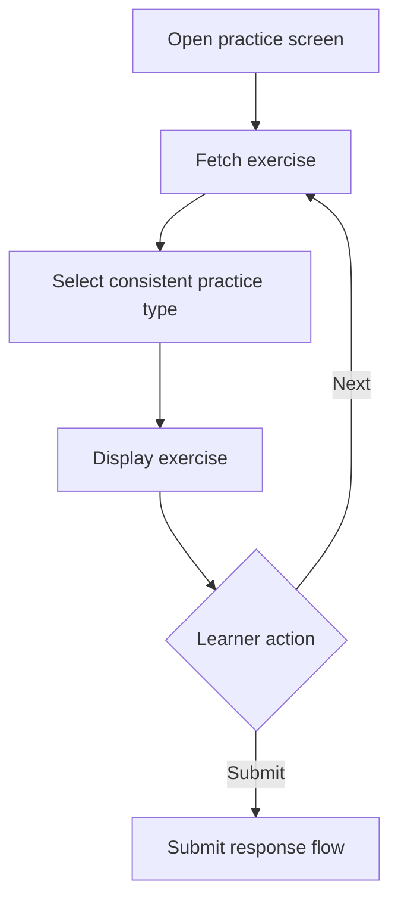

# View Practice Exercise

## Introduction

- **Description:** Let a learner view one practice exercise with its instructions, context, and required response.
- **User Goal:** Understand what to practice and how to respond.

## User Story

- As a learner, I want to view a practice exercise clearly so that I know what to do before responding.

## Scope

- Open the practice screen from a learning section and fetch one available exercise.
- Display exercise's title, meta-data, content, and response inputs.

## Dependencies

- An authenticated learner account and active exercise data.

## User Flow

1. The learner opens the practice screen.
2. The app fetches an exercise and displays it.
3. The learner responds or requests another exercise.
4. Submission is handled by the Submit Exercise Response feature.

## Practice Types

Here are supported practice types to help learners improve different skills:

### Communication

- **Communication:** Communicate in a real-life conversation.

### Vocabulary

- **Using Word:** Make a sentence using the study word.
- **Word Guessing:** Guess the word from its meaning.
- **Just One Word:** Guess the study word from clues.

### Articulation

- **Sentence Construction:** Make a sentence using provided words.
- **Sentence Variation:** Rewrite a sentence with the same meaning.
- **Paragraph Variation:** Rewrite a paragraph with the same meaning.

## Choosing Practice Types and Exercise Data

Choose a practice type compatible with the exercise's `skill` and `format`. Allowed practice types are defined in the [practice data specification](./data.md#practice-type); exercise content fields are defined in the [manage data specification](../manage/data.md#exercise).

`id`, `name`, and `topics` are required exercise data. Optional `references`, `practicedAt`, and `practiceCount` support context, tracking, or selection but do not replace format-specific content. Omitted optional fields without a specified default are not persisted.

## Exercise Display

Each practice type has a specific way it is displayed.

### Communication

- **Title:** The exercise's scenario
- **Topics:** Displayed below the title.
- **Explanation:** Communicate in a real-life conversation.
- **Prompt:** Randomly selected from the exercise's `prompts`.
- **Response input:** A sentence responding to the prompt.

### Using Word

- **Title:** Using Word
- **Topics:** Displayed below the title.
- **Explanation:** `Write a sentence using provided word`.
- **Content:** The target word and its meaning.
- **Response input:** A sentence using the target word or phrase.

### Just One Word

- **Title:** Just One Word
- **Topics:** Displayed below the title.
- **Explanation:** `Guess the word/phrase from these clues:`
- **Content:** clues for guessing the target word or phrase.
- **Response input:** A word or phrase guess.

### Word Guessing

- **Title:** Word Guessing
- **Topics:** Displayed below the title.
- **Explanation:** `Guess the word/phrase from the meaning below:`.
- **Content:** meaning of the target word or phrase.
- **Response input:** A word or phrase guess.

### Sentence Construction

- **Title:** Sentence Construction
- **Topics:** Displayed below the title.
- **Explanation:** `Make a sentence using the following words:`
- **Main content:** words required for the sentence.
- **Response input:** A sentence that uses the required words or phrases.

### Sentence Variation

- **Title:** Sentence Variation
- **Topics:** Displayed below the title.
- **Explanation:** `Rewrite the following sentence with the same meaning.`
- **Main content:** The original sentence.
- **Response input:** A rewritten sentence with the same meaning.

### Paragraph Variation

- **Title:** Paragraph Variation
- **Topics:** Displayed below the title.
- **Explanation:** `Rewrite the following paragraph with the same meaning.`
- **Main content:** The original paragraph.
- **Response input:** A rewritten paragraph with the same meaning.

## Acceptance Criteria

- An authenticated learner can fetch and view one active exercise at a time.
- The displayed title, topic, content, instructions, and response input follow the display rules.
- The learner can request another exercise without duplicate requests while loading.
- Loading, empty, unsupported, and incomplete states provide clear recovery options.
- Titles, prompts, content, inputs, and controls are keyboard and screen-reader accessible.

## Alternate Flows

- **No results or fetch failure:** Show an appropriate empty or error state with Retry and Leave options.
- **Unsupported or incomplete data:** Show an unavailable-exercise message and allow the learner to request another exercise.

## Edge Cases

- Re-viewing a `word` or `sentence` exercise may select a new practice.
- Long exercise content remains readable without horizontal scrolling.

## Related Documents

- [Practice Exercise Screen UI Specification](../../design/web/practice/practice-screen.md)
- [Get Practice Exercises API](../../design/api/practice/get-practice-exercises.md)
- [Submit Exercise Response Feature Specification](./submit-response.md)
