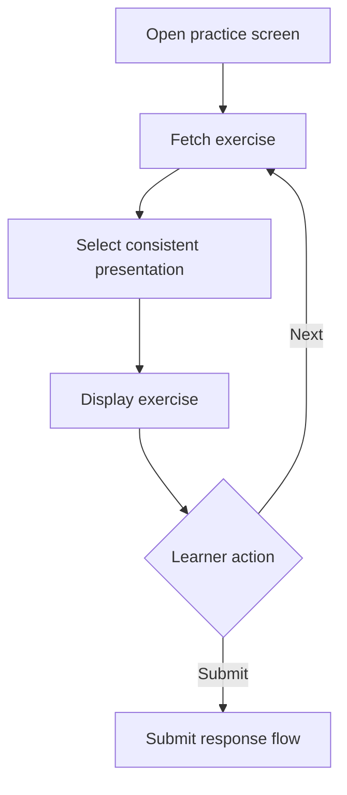

# View Practice Exercise

## Introduction

- **Description:** Let a learner view one practice exercise with its instructions, context, and required response.
- **User Goal:** Understand what to practice and how to respond.

## User Story

- As a learner, I want to view a practice exercise clearly so that I know what to do before responding.

## Scope

### Inclusions

- Open the practice screen from a learning section and fetch one available exercise.
- Display its learner-facing title, topic, content, instructions, and response requirements.

### Exclusions

- Creating, editing, deleting, importing, or selecting exercises from a list.
- Evaluating or submitting responses.
- Real-time tutoring, peer chat, leaderboards, or community challenges.

## Dependencies

- An authenticated learner account and active exercise data.

## Exercise Display Rules

The practice screen maps `format` to a learner-facing title and displays the topic immediately below it in parentheses:

| Exercise format | Displayed exercise title                    | Display behavior                                                                                                       |
| --------------- | ------------------------------------------- | ---------------------------------------------------------------------------------------------------------------------- |
| `communication` | exercise's scenario                         | Display the scenario as the title, the topic below it in parentheses, and one randomly selected prompt from `prompts`. |
| `word`          | Using Word, Just One Word, or Word Guessing | Randomly choose one of the three titles and render the corresponding word exercise presentation.                       |
| `sentence`      | Sentence Construction or Sentence Variation | Randomly choose one of the two titles and render the corresponding sentence exercise presentation.                     |
| `paragraph`     | Paragraph Variation                         | Display the paragraph variation presentation.                                                                          |

The selected title and presentation belong to the current view. A new exercise may receive a new presentation, which must remain consistent with its data.

## User Flow

1. The learner opens the practice screen.
2. The app fetches an exercise, selects its presentation, and displays the title, topic, instructions, and content.
3. The learner responds or requests another exercise.
4. Submission is handled by the Submit Exercise Response feature.

## Exercise Presentations

### Communication

- **Title:** The exercise's scenario
- **Topic:** Displayed below the title in parentheses.
- **Prompt:** Randomly selected from the exercise's `prompts`.
- **Response input:** Free-form response to the selected prompt.

### Using Word

- **Title:** Using Word
- **Topic:** Displayed below the title in parentheses.
- **Prompt:** `Write a sentence using "<word>" in <context> context` (hover or click on the word will show its meaning)
- **Response input:** A sentence using the target word or phrase.

### Just One Word

- **Title:** Just One Word
- **Topic:** Displayed below the title in parentheses.
- **Prompt:** `Guess the word or phrase from these clues:`
- **Main content:** clues for guessing the target word or phrase.
- **Response input:** A word or phrase guess.

### Word Guessing

- **Title:** Word Guessing
- **Topic:** Displayed below the title in parentheses.
- **Prompt:** `Guess the word or phrase from its meaning`.
- **Main content:** meaning of the target word or phrase.
- **Response input:** A word or phrase guess.

### Sentence Construction

- **Title:** Sentence Construction
- **Topic:** Displayed below the title in parentheses.
- **Prompt:** `Write a sentence using the following words:`
- **Main content:** words or phrases required for the sentence.
- **Response input:** A sentence that uses the required words or phrases.

### Sentence Variation

- **Title:** Sentence Variation
- **Topic:** Displayed below the title in parentheses.
- **Prompt:** `Rewrite the following sentence with the same meaning.`
- **Main content:** The original sentence.
- **Response input:** A rewritten sentence with the same meaning.

### Paragraph Variation

- **Title:** Paragraph Variation
- **Topic:** Displayed below the title in parentheses.
- **Prompt:** `Rewrite the following paragraph with the same meaning.`
- **Main content:** The original paragraph.
- **Response input:** A rewritten paragraph with the same meaning.

## Acceptance Criteria

- An authenticated learner can fetch and view one active exercise at a time.
- The title, topic, content, instructions, and response input match the display rules; `communication` uses its scenario and one random prompt.
- `word` randomly uses **Using Word**, **Just One Word**, or **Word Guessing**; `sentence` randomly uses **Sentence Construction** or **Sentence Variation**; `paragraph` uses **Paragraph Variation**.
- Word Guessing displays the meaning and accepts a revisable word or phrase guess.
- The learner can request another exercise, with duplicate requests prevented while loading.
- Loading replaces stale content; errors provide retry; no results provide retry or leave options.
- Unsupported formats or incomplete required data show an unavailable-exercise message rather than a misleading presentation.
- Titles, prompts, meanings, inputs, and controls are keyboard and screen-reader accessible.

## Alternate Flows

- **No results:** Show an empty state with retry and leave options.
- **Fetch failure:** Show `We couldn't load the exercise. Please try again.` or equivalent, with Retry.
- **Unsupported or incomplete data:** Show an unavailable-exercise message and allow the learner to request another exercise; do not infer a presentation.

## Edge Cases

- Re-viewing a `word` or `sentence` exercise may select a new presentation.
- Word Guessing guesses remain editable without fetching another exercise.
- Repeated **Next** actions do not duplicate in-flight requests; the latest result wins after leaving and returning.
- Long exercise content remains readable without horizontal scrolling.

## Data Requirements

The screen consumes fields returned by the Get Practice Exercises API:

| Format          | Required display data                                     |
| --------------- | --------------------------------------------------------- |
| `communication` | `name`, `scenario`, `topics`, `prompts`                   |
| `word`          | `name`, `topics`, `word`, `meaning`, `sentences`, `clues` |
| `sentence`      | `name`, `topics`, `prompts`, `words`                      |
| `paragraph`     | `name`, `topics`, `prompts`, `paragraph`                  |

Optional `id`, `skill`, `references`, `practicedAt`, and `practiceCount` support context, tracking, or selection but do not replace required content.

## Related Documents

- [Practice Exercise Screen UI Specification](../../design/web/practice/practice-screen.md)
- [Get Practice Exercises API](../../design/api/practice/get-practice-exercises.md)
- [Submit Exercise Response Feature Specification](./submit-response.md)
